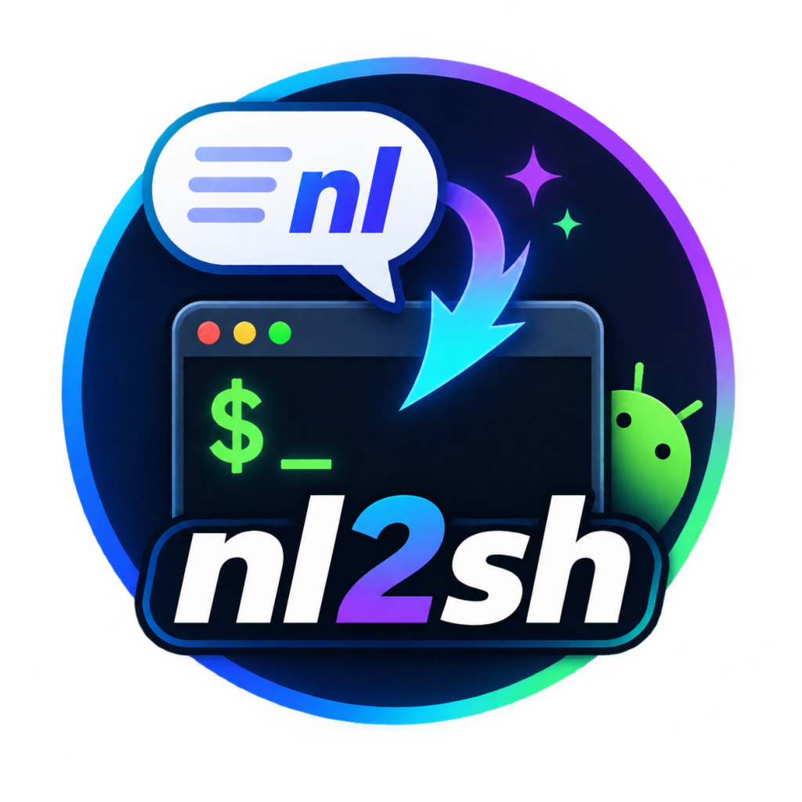

<p align="center">
  
</p>

<h1 align="center">nl2sh</h1>

Natural Language to Shell 是以 Android 原生 `adb shell` 为一等运行环境、同时兼容 Termux 的类 Hermes AI Agent。直接 Android 部署以单个可执行文件交付，无需 Termux 或设备端运行时依赖；Termux 用户可选择包管理安装。它提供丰富的 TUI 和内置 Web 多会话界面，用于对话、实时结果、安全确认、历史恢复和配置。自然语言任务由多轮 Tool Calling 连接 OpenAI 兼容模型与本地工具；需要执行的操作先经过本地安全分类和确认，再把真实结果返回模型。

“类 Hermes”指的是自主 Agent 的产品形态和 Tool Calling 交互方式；nl2sh 专注 Android shell，不声称与 Hermes 的 API、插件或全部功能兼容。

可选的主机侧 [A2A 网关](a2a_gateway/README.md) 和 stdio MCP 适配层让其他 Agent 发现并调用连接设备上的 nl2sh，支持环境盘点、工具目录、多轮咨询与任务查询。构建和独立候选版本部署是主机侧显式工作流，不作为远程 Agent 技能。设备端仍是单个 Rust 可执行文件；无人值守的 A2A/MCP 调用不能批准修改或危险操作。

## 特性与安全边界

- 默认使用多轮 Agent Tool Calling；也支持只生成单条命令的 Command 模式。
- 核心程序是单文件 Android 可执行程序，可直接推送到设备运行。
- 丰富 TUI 支持 LLM 文本流式渐变输出、实时状态与命令输出、内嵌确认、历史滚动、工具结果折叠、Markdown 渲染、中英文界面和热重配置。
- 内置 Web 支持多个独立 Agent 会话、流式结果、图表、审批与配置；进行中任务保存脱敏检查点，重启后可查看中断诊断，不自动续跑。
- 内置 `read_file`、`list_dir`、`search_text`、`apply_patch` 结构化文件工具；允许绝对路径、父目录和符号链接，资源大小仍受限，补丁先展示 diff 并确认。
- 内置 `analyze_audio` 对 WAV/Raw PCM 做纯 Rust 确定性 DSP 分析；WAV 以真实 header 为准，无头 PCM 缺少可靠元数据时弹出结构化问答窗口，可直接选择常用值或输入自定义采样率、声道数和采样格式，不会把猜测当事实。
- 内置 `judge_audio_quality` 对 Feature JSON 做多维音质判断；配置 Jev Key 时使用 Jev，否则使用当前通用 LLM，原始 WAV 不上传给判断模型。
- 内置完整 Android 交互闭环：读取 UI 树后可对仍匹配的控件 bounds 执行确认后的点击、滑动、长按和文本输入；默认返回紧凑可操作节点，操作后附带最新界面状态；PNG/JPEG/WebP 截图会在必要时有界缩放后交给支持视觉的模型，图片不保存进会话。
- 内置通知、Crash/ANR、温控功耗、流量、存储、Wi-Fi/以太网、Doze、权限、剪贴板、媒体、MediaStore 和连接性结构化工具，以及小型私有 Agent 便签；写入与控制操作始终需要确认。
- 输入 `@` 可引用文件或目录并显示候选，支持相对/绝对路径及 `@~`、`@/`、`@.`；Up/Down 选择、Enter/Tab 补全，也可直接输入 `@test.txt写的是什么内容`。引用只解析路径，内容由有界结构化文件工具读取。
- 可选接入腾讯 ima 知识库，Agent 可发现知识库、搜索资料并读取有界原文；连接器只读、始终无代理直连，不提供上传、追加、导入或删除操作。
- 完整对话自动保存，首轮完成后自动生成简短会话标题；可用 `/sessions` 列表、恢复、重命名或删除；凭据、余额和临时审批不保存。
- 审批窗口根据命令或 diff 动态调整宽高；超高内容可用滚轮或 PageUp/PageDown 浏览，操作选项始终固定可见。
- 内置 OpenRouter、OpenAI、DeepSeek、Moonshot/Kimi、SiliconFlow 与 Ollama，支持 Chat Completions、Responses API 和自定义 OpenAI 兼容 endpoint。
- `balanced` 默认策略自动执行只读查询、确认修改操作、二次确认危险操作。
- LLM 不能决定确认、风险等级、root 提升或超时；用户编辑后的命令必须重新分类。
- 支持当前用户、自动提升和强制 root 模式。非 root 提升使用参数化的 `su -c <command>`，不拼接 shell 字符串。
- crossterm + ratatui 终端界面通过 RAII 和 panic hook 恢复 raw mode、alternate screen、鼠标捕获和光标；滚轮浏览历史，Shift+拖选后可使用宿主终端的右键菜单复制。
- 一等目标为 Android API 26+ 原生 shell、`aarch64-linux-android` 和 `/data/local/tmp`；运行时自动识别直接 Android shell 与 Termux，不改变安全确认边界。
- Termux 作为兼容运行环境，提供 TUR 配方和自建签名 APT 仓库；包管理构建关闭程序内自更新，由 `pkg upgrade nl2sh` 统一管理。

默认执行路径使用 Unix `openpty`：slave 成为子进程 controlling terminal，master 非阻塞读取，stdout/stderr 合并，超时会清理整个进程组。识别到全屏/交互命令时，nl2sh 临时使用本地 raw mode，桥接 stdin/master 输出并同步窗口尺寸，结束后恢复终端。不同 Android 终端和全屏应用仍可能存在兼容差异，详见 `PROJECT_STATUS.md`。

## 构建

需要 stable Rust（edition 2021）和 Node.js 22+ / npm。Cargo 构建脚本会将 `web/` 源码复制到 Cargo 输出目录，在副本中执行 `npm ci` 与 `npm run build`，再把页面资源编入 Rust 程序；修改前端源码后直接运行 Cargo 即可。桌面 Unix 环境用于开发验证：

```bash
cargo build
cargo test
cargo build --release
```

HTTP 使用 rustls，未启用 native-tls。

### 内置 Web 界面

交互式启动时会同时在 `0.0.0.0:9999` 启动内置 HTTP 服务；端口占用时会选择可用端口。启动欢迎内容末尾会突出显示当前设备的 Web 地址，例如 `http://192.168.1.20:9999/`，方便复制到同一网络中的浏览器；页面无需登录。页面可编辑并保存完整 TOML 配置；服务会校验配置并沿用私有权限的原子保存流程。Web 会话每个新任务读取最新配置，终端 TUI 的当前会话需重启后才会使用 Web 修改的配置。

首次未配置模型服务时，Web 会自动打开“快速开始”，首选 DeepSeek 并预填 `deepseek-flash`；列表还包括 OpenRouter、OpenAI、Moonshot/Kimi、SiliconFlow、Ollama 和其他自定义服务。OpenAI 使用官方地址；其他自定义服务可在下一步编辑 Base URL。引导按选择服务、填写密钥与模型、保存并测试实际模型对话的顺序进行，也可随时从顶栏重新打开。空白对话提供只读任务示例，首次发送会自动创建会话。默认视图突出对话和当前进度；工具目录和设备概览位于顶栏，终端、快捷运行参数与详细统计收在“高级功能”中。审批先说明本地评估的风险和检查依据，同时完整展示待执行内容；编辑后仍重新评估。模型最终回答被要求说明已完成内容、证据、失败或未验证部分及有证据支持的设备修改情况。入门操作见[新手指南](新手指南.md)。

Web 的“快速开始”保存设置后会发送一条短模型测试请求，确认实际对话接口可用。顶栏“设备概览”无需模型即可读取有界的只读系统、内存和存储信息；“能做什么”按用途展示中文工具说明、确认要求与示例提问。运行中的任务可在输入区停止：模型等待立即取消，正在执行的命令会先终止并回收进程组，其他工具在当前操作结束后停止。完成的对话在工具卡片下方汇总完整、部分和失败结果；审批及其他弹窗支持键盘焦点留在弹窗内，Esc 关闭或拒绝。

左侧会话列表和上方菜单可分别收起或展开，浏览器会记住各自状态；侧栏收起后仍可新建会话。窄屏浏览器将会话列表移到页面顶部并可横向滚动，收起后为对话留出更多空间；顶栏操作和高级快捷设置也可横向滚动。快速开始与审批在较短的屏幕上保留底部操作按钮，配置分类横向排列，字段在下方滚动查看。

Web 页面提供类似 dsh 的多会话侧栏。多个 Agent 会话可同时运行；切换会话不会停止后台任务，列表会显示运行中和等待审批状态，并在轮数后显示创建时间：一天内为相对时间，超过一天为日期和时刻。侧栏可直接删除单个会话，删除全部会话前会确认，同时清理已保存快照；运行中、等待审批或终端仍连接的会话不能删除。每个会话独立保存对话、实时文字与命令输出、审批和结构化补充信息，首轮完成后由当前 LLM 自动生成简短标题。历史会话可从侧栏快速恢复。模型流式增量会拼接在同一 Markdown 段落；每次工具调用及其结果各自成为默认折叠项，可独立展开，按 F2 可将当前对话的工具卡片全部展开或收起，失败结果保留错误标记。顶部快捷栏可切换 Provider、模型和审批策略、刷新 Provider 模型列表，并显示轮次、Agent 步骤、工具调用、Token/上下文和 Root 状态。Web Agent 使用与 TUI 相同的安全评估、确认和执行链；Web 审批的命令采用捕获式执行。Web 与终端各自维护对话状态。配置包含 API Key 等凭据，且 Web 无登录并监听所有 IPv4 接口；请只在受信任的网络中运行。

Web 任务进行中会保存有界、脱敏的检查点。若服务重启，页面会显示已保存的请求和工具结果并标记任务中断；这些诊断内容不会自动交给模型续跑，待审批操作也不会恢复为已批准。完整回答先保存，自动标题随后更新；浏览器重新连接时会清除已不存在会话的旧“运行中”状态。

统计对比或趋势适合图形时，Agent 可用只读 `create_chart` 工具展示柱状图、折线图或饼图。Web 图表直接显示在对话中，附模型填写的数据来源，并可展开查看原始数值；恢复会话后仍可显示。TUI 显示相同数值的文字列表。图表工具只校验数据格式和大小，不自行采集或核实数值；请结合原始工具结果判断统计结论。

页面右上角的“导出日志”会下载当前选中会话的 ZIP，包含导出时显示的对话与未完成任务检查点事件 `conversation.json`、当前审计日志 `nl2sh.log` 和范围说明。审计日志由所有会话共用，因此可能包含其他会话事件；如果尚无日志文件，包内日志为空。

Web 对话输入框输入 `@` 时会列出当前路径候选，支持与 TUI 相同的相对路径、绝对路径、`~/`、`./` 和 `../`；Up/Down 选择，Enter/Tab 补全，目录可继续下钻。提交后路径引用仍只作为 Agent 文件工具提示。右上角“工具”可查看当前配置下可用的工具名称和简介，并按名称或简介搜索。

Web 后端使用 Tokio 和 Axum 0.8，配置及会话协议使用 serde JSON，Agent 状态和流式输出通过 SSE 推送，安全终端使用 WebSocket。前端源码位于 `web/`，使用 Preact、TypeScript、Vite 和纯 CSS；生产资源由 `rust-embed` 编入可执行文件。发布包无需携带 HTML、JavaScript 或 Node.js，Android ARM64 仍只部署一个 ELF binary。

安全终端将命令结果的标准输出、标准错误和退出状态分段显示；输出中的换行和窄屏长文本会在页面中换行。

Web 深色页面与 TUI 共用 `UI_DESIGN.md` 的语义色板：灰白正文、青蓝导航与焦点，以及仅用于状态的绿/黄/红；CSS token 集中在 `web/src/style.css`。颜色不替代审批和风险文字。

单独验证前端可运行：

```bash
cd web
npm ci
npm test
npm run build
```

`web/dist/` 仅用于手工运行前端构建，Cargo 构建产物位于 `target/`；两者和 `web/node_modules/` 都不纳入源码管理。发布 CI、Android 交叉编译及 Termux 打包同样由 Cargo 构建脚本生成 Web 资源，不改写发布源码包；构建时需有可用的 Node.js/npm，设备运行时仍无需 Node.js。

项目使用 MIT License，详见 `LICENSE`。

## Android 交叉编译和部署

安装目标并配置 Android NDK：

```bash
rustup target add aarch64-linux-android
export ANDROID_NDK_HOME=/path/to/android-ndk
./cross-compile.sh
adb push target/aarch64-linux-android/release/nl2sh /data/local/tmp/
adb shell chmod +x /data/local/tmp/nl2sh
adb shell -t /data/local/tmp/nl2sh
```

脚本默认 API 26 和 `aarch64-linux-android`，可通过 `ANDROID_API_LEVEL` 与 `RUST_TARGET=armv7-linux-androideabi` 覆盖。也接受 `ANDROID_NDK_ROOT`。它不要求 Termux、bash 位于 Android 设备上或 GNU coreutils。

也可以一键完成 release 交叉编译、推送、授权并进入带 TTY 的 adb shell 启动应用：

```bash
export ANDROID_NDK_HOME=/path/to/android-ndk
./android-build-run.sh
```

Windows PowerShell 可使用原生 NDK Windows 工具链执行同一流程，不需要 Bash 或 WSL：

```powershell
$env:ANDROID_NDK_HOME = "C:\Android\Sdk\ndk\28.2.13676358"
.\android-build-run.ps1
```

默认推送到 `/data/local/tmp/nl2sh`。`android-build-run.sh` 与 `android-build-run.ps1` 会在没有设备时提示输入网络 ADB 地址、单设备自动选择、多设备按编号选择，并根据设备 ABI 自动选择 AArch64 或 ARMv7 Rust target；显式设置的 `RUST_TARGET` 与设备不匹配时会停止。可用 `ANDROID_DIR=/data/local/tmp/tools` 修改设备目录，也可用 `ADB_SERIAL=<serial>` 预选设备。脚本要求主机 `PATH` 中可找到 `adb`，设备端仅使用 Android 自带的 `mkdir`、`chmod` 和 shell。连接后会先执行 `adb root`、等待 adbd 重启并验证 `id -u`；root adbd 成功时，后续推送和启动均以 root 进行。设备不支持 `adb root` 时才尝试 `su -c`，两者都不可用且已有 `0600 config.toml` 不可读时会提前报错，不会放宽 API Key 配置文件权限。

预编译发布包同时包含 `bin/arm64-v8a/nl2sh` 与 `bin/armeabi-v7a/nl2sh`，无需 Rust 或 NDK。Linux 使用 `android-run-linux.sh`，Windows 双击 `android-run-windows.bat`；两者都会选择已连接的 ADB 设备、查询 ABI 并推送匹配程序，也支持 `ANDROID_DIR` 和 `ADB_SERIAL`：

```bash
chmod +x android-run-linux.sh bin/arm64-v8a/nl2sh bin/armeabi-v7a/nl2sh
./android-run-linux.sh
```

```bat
set ADB_SERIAL=device-serial
android-run-windows.bat
```

### 通过 GitHub Actions 自动发布

仓库内置 `.github/workflows/release.yml`。推送 `v*` tag（如 `git tag v0.2.0 && git push origin v0.2.0`）会触发 GitHub Actions：并行交叉编译 `aarch64-linux-android`（arm64-v8a）与 `armv7-linux-androideabi`（armeabi-v7a），再把两种程序分别放入 `bin/arm64-v8a/` 和 `bin/armeabi-v7a/`，连同 Linux/BAT 启动脚本、`config.toml.example` 和 `使用说明.md` 合并为一份 `nl2sh-android.tar.gz` 与 `nl2sh-android.zip`，并附带 `SHA256SUMS` 发布到对应 tag 的 GitHub Release。Actions 页的 `workflow_dispatch` 可手动触发并生成草稿 Release（tag 通过输入指定）。

下载统一发布包并完整解压后，Linux 直接运行 `./android-run-linux.sh`，Windows 双击 `android-run-windows.bat`。没有设备时脚本提示输入网络 ADB 地址，单设备自动选择，多设备按编号选择；随后自动检测 ABI，并完成 root adbd/`su` 回退部署。Windows 启动脚本还会启用 alternate-scroll 兼容模式：不请求远端鼠标捕获，由 Windows Terminal 将滚轮转换成 Up/Down 输入，再由 nl2sh 滚动历史；Linux 路径继续使用原生鼠标事件。

需要在本地生成与 GitHub Release 相同目录结构的统一 ZIP 时，先配置 Android NDK，然后运行对应宿主脚本：

```bash
export ANDROID_NDK_HOME=/path/to/android-ndk
./pack-release.sh
```

```powershell
$env:ANDROID_NDK_HOME = "C:\Android\Sdk\ndk\28.2.13676358"
.\pack-release.ps1
```

两个脚本都会构建 AArch64 与 ARMv7 release，将程序放入对应 ABI 子目录，并输出 `dist/nl2sh-android.zip` 和 `dist/SHA256SUMS`；不连接或部署 ADB 设备。

### Termux APT 安装

推荐通过 Termux User Repository（TUR）安装。`tur/nl2sh/build.sh` 配方已合并，可使用：

```bash
pkg install tur-repo
pkg install nl2sh
```

仓库内的 `tur/nl2sh/build.sh` 是可复制到 TUR fork 的提交配方；版本发布后必须同步更新 `TERMUX_PKG_VERSION` 与源码归档 SHA-256，并在 TUR 环境运行 `TERMUX_INSTALL_DEPS=true ./build-package.sh -a <arch> nl2sh`。

以下自建 APT 仓库继续作为独立分发渠道。

当前自建仓库仅发布已经验证的 `aarch64` 和 `arm`，暂不发布 `x86_64` 或 `i686`。首次安装仓库公钥和软件源：

```bash
mkdir -p "$PREFIX/etc/apt/keyrings"
curl -fsSL https://nl2sh.github.io/nl2sh/nl2sh-repo.gpg \
  -o "$PREFIX/etc/apt/keyrings/nl2sh.gpg"
echo "deb [signed-by=$PREFIX/etc/apt/keyrings/nl2sh.gpg] https://nl2sh.github.io/nl2sh stable main" \
  > "$PREFIX/etc/apt/sources.list.d/nl2sh.list"
pkg update
pkg install nl2sh
```

APT 版本的默认配置位于 `$XDG_CONFIG_HOME/nl2sh/config.toml`，未设置时使用 `~/.config/nl2sh/config.toml`；日志和会话位于 `$XDG_STATE_HOME/nl2sh`，未设置时使用 `~/.local/state/nl2sh`。`NL2SH_CONFIG` 可以覆盖默认配置路径，显式 `--config` 仍具有最高优先级。直接推送到 Android 的版本继续使用可执行文件旁的 `config.toml`，保持现有部署兼容。

APT 版本不会直接替换 `$PREFIX/bin/nl2sh`。`nl2sh update` 和 TUI `/update` 会提示使用 `pkg upgrade nl2sh`。

发布流水线需要仓库 Secret `TERMUX_APT_GPG_PRIVATE_KEY`，内容为无交互口令的 ASCII-armored 私钥。tag 构建会生成两个架构的 `.deb`、签名 `InRelease`/`Release.gpg` 和 GitHub Pages 仓库；本地打包及仓库脚本位于 `packaging/termux/`。

本地直接生成两个架构的 `.deb`：

```bash
export ANDROID_NDK_HOME=/path/to/android-ndk
./pack-termux-release.sh
```

Windows PowerShell 使用 Windows NDK 编译，再调用默认 WSL 发行版中的 `dpkg-deb` 封包：

```powershell
$env:ANDROID_NDK_HOME = "C:\Android\Sdk\ndk\28.2.13676358"
.\pack-termux-release.ps1
```

Windows 路径中的空格会通过 `wslpath` 转换；WSL 内只需提供 `bash` 和 `dpkg-deb`，不会在 WSL 中重复编译。缺少工具时可在 Ubuntu/Debian WSL 中运行 `sudo apt install dpkg`。

两个脚本均输出 `dist/nl2sh_版本_aarch64.deb` 和 `dist/nl2sh_版本_arm.deb`，不创建 ZIP，也不读取或包含 APT 仓库私钥。独立安装说明见 `Termux使用说明.md`。

开发时可自动选择已安装 Termux 的 ADB 设备、按设备 ABI 构建单个 `.deb`，并通过 SSH/tmux 安装运行：

```bash
./android-build-tmux-run.sh
```

Termux 需预先执行 `pkg install openssh tmux`、`passwd` 和 `sshd`。可通过 `ADB_SERIAL`、`TERMUX_SSH_LOCAL_PORT`、`TERMUX_SSH_REMOTE_PORT`、`TERMUX_TMUX_SESSION` 与 `ANDROID_TMP_DIR` 覆盖默认设备、端口、会话名和 `/data/local/tmp` 临时目录。

### Android 提示 `No such file or directory`

如果 `/data/local/tmp/nl2sh` 明明存在且已有执行权限，但运行时仍提示：

```text
/system/bin/sh: ./nl2sh: No such file or directory
```

这通常不是文件路径不存在，而是二进制 ABI 与设备不匹配，导致 Android 找不到 ELF 指定的动态加载器。例如，只支持 `armeabi-v7a` 的 32 位设备不能运行默认生成的 `aarch64-linux-android` 64 位程序；该程序请求 `/system/bin/linker64`，而 32 位设备只有 `/system/bin/linker`。

先检查设备 ABI 和远端二进制：

```powershell
adb shell getprop ro.product.cpu.abi
adb shell getprop ro.product.cpu.abilist
adb shell file /data/local/tmp/nl2sh
```

- `arm64-v8a`：使用默认的 `aarch64-linux-android`。
- `armeabi-v7a` 且 ABI 列表中没有 `arm64-v8a`：必须构建 `armv7-linux-androideabi`。

Windows PowerShell 构建并部署 ARMv7 版本：

```powershell
rustup target add armv7-linux-androideabi
$env:RUST_TARGET = "armv7-linux-androideabi"
.\android-build-run.ps1
```

Linux/macOS 使用相同目标：

```bash
rustup target add armv7-linux-androideabi
RUST_TARGET=armv7-linux-androideabi ./android-build-run.sh
```

重新推送后，`adb shell file /data/local/tmp/nl2sh` 在 ARMv7 设备上应显示 `ELF 32-bit`、`ARM` 和 `/system/bin/linker`，不应显示 `64-bit arm64` 或 `/system/bin/linker64`。如果 ABI 已匹配，再检查文件权限、ELF interpreter 是否存在，以及二进制是否确实由 Android NDK 而非桌面工具链构建。

## 配置

Web 配置页可按“服务、模型与智能体、执行与安全、界面与日志、网络、知识库与音频”等分类编辑字段，也可切换到完整 TOML 文件编辑。编辑时会实时检查格式和运行配置；只有有效配置可以保存。保存后新的 Web 任务自动使用新配置，已运行的任务继续使用启动时的配置；当前 TUI 会话重启后读取新配置。自定义 `[[security_rules]]` 请在配置文件模式编辑。

直接 Android 部署的默认配置位于解析符号链接后的可执行文件目录，名称为 `config.toml`；Termux APT 安装使用上文的 XDG 配置与状态目录。配置不存在时直接进入 TUI，使用 `/config` 打开统一设置面板；旧的逐行配置向导和 `--init` 已移除。配置完成前普通任务不会发送给模型。配置以 `0600` 权限创建，也可传入 `--config /path/config.toml`，或设置 `NL2SH_CONFIG`。

```bash
cp config.toml.example config.toml
```

配置优先级为 CLI 参数、`NL2SH_API_KEY`、`config.toml`、字段默认值。CLI 可用 `--endpoint`、`--model`、`--api-type` 覆盖 provider 设置；覆盖后统一校验，因此可以修正文件中的对应无效值。空 API Key 适用于本地服务，此时不会发送空 Authorization header。不要提交真实 key。

默认 Provider 是 OpenRouter（`https://openrouter.ai/api/v1`），默认模型是 `openrouter/free`；首次使用需在 `/config` 中填写 OpenRouter API Key，或设置 `NL2SH_API_KEY`。`openrouter/free` 会由 OpenRouter 在可用的免费模型之间路由，实际能力和限额取决于服务端当前策略。

`api_type` 默认是 `auto`，因此配置文件可省略该字段。首次请求优先使用 Responses；仅当端点不存在、明确不支持，或在尚未输出任何内容时返回不兼容结构，才回退 Chat Completions，并在当前进程缓存成功协议。鉴权、限流、5xx、超时和已经产生流式内容后的错误不会触发切换。遇到特殊兼容服务时仍可显式设置 `responses` 或 `chat_completions`，也可用 `--api-type` 临时强制覆盖。

腾讯 ima 为独立的可选只读连接器，可在 `/config` 的“知识库”分类配置，或使用环境变量 `NL2SH_IMA_CLIENT_ID` 与 `NL2SH_IMA_API_KEY`。TOML 字段为 `ima_enabled`、`ima_client_id`、`ima_api_key`，可选 `ima_knowledge_base_id` 用于固定默认知识库；未指定时会有界发现可访问知识库。启用后 Agent 获得知识库列表、搜索和原文读取工具。ima 客户端始终无代理直连，不继承网络 Tab 的代理设置；API Key、Client ID、临时下载 header 和签名 URL不会进入模型、审计日志或会话文件。远程资料被视为不可信数据，不会作为系统指令执行。项目不实现任何 ima 写操作。

`model_context_window` 和 `model_max_output_tokens` 是可选的 Token 限额覆盖；省略上下文窗口时，nl2sh 优先使用 Provider 元数据，再使用内置的保守模型注册表。OpenRouter、OpenAI、DeepSeek、SiliconFlow 使用各自的 OpenAI 风格模型列表，Ollama 使用原生 `/api/tags` 与 `/api/show` 读取本地模型及上下文。状态栏的上下文百分比使用最后一次模型请求的输入 Token 除以已知窗口估算，未知时显示 `?`。实际输入 Token 达到上下文安全水位后，Agent 会按观测用量动态淘汰最旧的完整历史轮次；system instruction、当前轮次和完整 Tool Calling round 不会被拆分，`max_context_turns` 仍是硬上限。

Agent 任务默认使用 Normal 预算：50 Step、100 次 Tool Call、30 分钟活跃运行时间；`agent_mode` 可选 `fast`（20/40/10 分钟）、`normal` 或 `deep`（100/200/60 分钟），并可用 `max_agent_steps`、`max_tool_calls`、`max_task_execution_time_secs` 逐项覆盖。`hard_max_agent_steps` 默认 200，始终限制有效 Step。等待命令确认不计入活跃时间；重复动作、连续无进展和接近预算都会促使 Agent 改变策略或收敛，但不会绕过风险分类、确认和 root 策略。

`/balance` 使用当前 API Token 调用公开的只读账户接口；当前支持 DeepSeek `/user/balance` 和 SiliconFlow `/user/info`。支持时 TUI 进入会话即查询、每 60 秒静默刷新并将最近一次成功余额常驻顶栏；手工 `/balance` 会立即刷新，失败时保留已有显示值。OpenRouter、Moonshot/Kimi、OpenAI、自定义服务及没有公开 Bearer Token 余额接口的 Provider 会明确显示不支持。余额只保留在当前进程内存，不进入 JSONL 日志、模型上下文或配置文件。

`execute_user_mode`：

- `auto`：UID 0 直接运行；普通命令保持当前用户；明确需要 root 时才尝试 `su -c`。
- `normal`：永不自动调用 `su`。
- `root`：UID 非 0 时必须通过 `su`，失败时不静默降级。

`history_log_file` 默认为 `nl2sh.log`，相对路径按 `config.toml` 所在目录解析。日志采用逐行 JSON，记录用户输入、命令、输出、结果和错误并在每条记录后刷新；新文件权限为 `0600`。日志可能包含命令输出中的设备信息，排查完成后应按实际保密要求保管或清理，但不会写入 API Key。设置面板“界面”分类中的“清除审计日志”可用 Enter 截断当前日志，清除后本次进程仍会继续记录新事件。\n\n输出资源默认受限：实时 TUI 为 256 KiB、单个捕获流为 1 MiB、单个发给模型的 Tool Result 为 128 KiB、单条日志事件为 256 KiB、单个日志文件为 10 MiB。对应配置项为 `ui_live_output_max_bytes`、`tool_output_max_bytes`、`model_tool_output_max_bytes`、`history_log_event_max_bytes` 和 `history_log_max_bytes`。所有内容截断都会插入 `NL2SH ... TRUNCATED` 标记；日志达到文件上限后停止追加，不会静默形成不完整记录。

`ui_language` 控制终端界面语言，可选 `zh_cn` 或 `en`，默认 `zh_cn`。使用 `/config` 或其别名 `/setting` 打开统一设置面板；原 `/provider`、`/model`、`/models`、`/proxy` 命令已移除。“服务”分类可用 Left/Right 在 OpenRouter、OpenAI、DeepSeek、Moonshot/Kimi、SiliconFlow、Ollama 和 Custom 间选择，内置项会回填 Endpoint 但保留 API Key、模型与协议。Tab/Shift+Tab 切分类，Up/Down 选字段，Left/Right 调整当前值，Ctrl+S 保存；面板接管键盘焦点，当前文本字段具有输入边界、背景和闪烁光标。最大步骤和轮次显示推荐值 24/16。`show_buddha_ascii_art` 与 `show_train_ascii_art` 分别控制佛像和启动小火车，默认均为 `true`，可在“界面”分类中独立关闭。

设置面板的“网络”Tab 支持 HTTP/HTTPS CONNECT、SOCKS5 和推荐的 SOCKS5H（由代理解析 DNS），以及可选用户名、密码和绕过列表。总开关关闭时保留其他代理字段。代理设置统一用于模型请求、模型发现、余额和更新检查；密码掩码显示，不进入对话或审计日志。

每个 Android Agent 任务开始时会向 system prompt 附加一次低敏感运行环境摘要，包括直接 Android shell/Termux、API level、ABI、当前 shell、UID 和 root/su 能力。直接 Android shell 使用 `/system/bin/sh` 与 toybox 的保守基线；Termux 兼容模式使用 `$PREFIX/bin/sh`、XDG 路径并允许 `pkg`/`apt` 基线，但仍先探测可选程序。摘要不包含型号、序列号、Android ID、IP、账号或应用列表，也不会改变安全分类、确认和提权策略；内存、存储与网络等易变信息仍由工具按需查询。

## 使用

TUI 将所有去除前导空白后以 `/` 开头的输入保留为本地命令；未知斜杠命令只显示本地提示，不会发送给 LLM。

输入 `@` 后会在光标附近显示当前路径候选，目录以 `/` 结尾并可继续补全。候选最多展示 10 行，使用 Up/Down 选择、Enter 或 Tab 写入；Right 保持普通光标右移。支持 `@file.txt`、`@dir/`、`@./relative`、`@../parent`、`@/absolute` 和 `@~/home`。提交时解析 `@` 后最长的已存在路径，因此路径后可直接连接中文问题，例如 `@test.txt写的是什么内容`。解析后的绝对路径仅作为 Agent 文件工具提示，不会直接执行文件内容或绕过命令确认。

在一次设置面板会话中，Ollama 与 Custom 分别保留自己的 Endpoint 草稿；切换到其他 Provider 再切回来时，会恢复该选项此前填写的地址。

设置面板的“模型与智能体”Tab 提供“在线模型列表”，选中后按 Enter 会在后台从当前 Provider 拉取模型；成功后使用 Up/Down 和 Enter 选择并回填模型元数据，失败时保留手工输入。

```bash
nl2sh                         # TUI Agent 模式
nl2sh "列出 /data 最大的十个文件" # 单次 Agent 请求
nl2sh --mode command "查看内存"   # 生成、分类并执行单条命令
nl2sh --mode command --dry-run "查看内存"
nl2sh --endpoint http://127.0.0.1:11434/v1 --model local --api-type chat_completions "查看系统"
nl2sh --no-pty --ascii
nl2sh update                  # 检查并安装最新 Android 构建
```

Command 模式生成、分类后执行单条命令；`--dry-run` 只展示。TUI 中输入 `!command` 可不经过模型而直接运行命令，即使尚未配置 Provider 也可使用；命令仍会经过安全分类与必要确认，修改、危险、Root 和编辑后的命令不能绕过保护。实时输出与退出状态显示在当前界面，但不会加入模型上下文。需要多轮执行和结果回传时使用默认 Agent 模式。Agent TUI 在请求和捕获式执行期间保持同一 frame，并在界面内显示输出与确认弹窗；审批弹窗支持方向键与 Enter，也可直接使用 `1-7` 或 `y/n/a/r/e/i/t` 选择允许一次、当前任务允许完全相同命令、本次运行允许全部普通修改、拒绝、编辑、交互执行或捕获执行。运行期许可也可用 `/permission allow` 开启、用 `/permission ask` 关闭、用 `/permission` 查看状态；它只保存在当前进程内存中。任务级与运行期许可均不适用于 Root、Dangerous、Critical 或强确认操作，也不持久化。命令运行时实时展示有界输出，完成后工具结果默认折叠，按 F2 可展开或收起；超出各层配置上限时，日志和模型上下文会携带明确截断标记。Agent 总结支持终端 Markdown 渲染。TUI 使用统一的现代深色语义主题，并按终端能力选择 TrueColor 或 ANSI 256 palette；普通正文保持灰白，青蓝表示交互与焦点，绿色、黄色和红色分别保留给成功、警告和错误。底部输入框使用低对比度深色背景和青蓝色闪烁光标，支持 Left/Right/Home/End/Delete 编辑及 Up/Down 调取当前会话输入历史；输入 `/` 时显示垂直命令候选，使用 Up/Down 选择、Enter 补全，当前提供 `/help`、`/clear`、`/config`、`/setting`、`/permission`、`/balance`、`/sessions`、`/update` 和 `/exit`。每次 Agent 任务完成后，状态栏显示该任务跨全部 Tool Calling 步骤累计的输入、输出和总 Token；Provider 未返回用量时显示未知而不是零。TUI 启用鼠标追踪以稳定接收滚轮；复制屏幕文字时按住 Shift 拖选，由宿主终端高亮选区，再通过右键系统菜单复制。对话区只保留上下边框，避免选取内容混入左右边框。另支持 PageUp/PageDown 浏览历史、Enter 提交、Ctrl+C 取消当前任务（空闲时清空输入）、Ctrl+Q 安全退出。

会话在每个完整 Agent turn 后自动保存到配置目录旁的私有 `sessions/` 目录，首轮完成后由当前模型异步生成简短标题，`/sessions` 列表显示标题。稳定的内部名称只接受字母、数字、`-` 和 `_`：`/sessions` 列表，`/sessions resume NAME` 恢复，`/sessions rename OLD NEW` 重命名，`/sessions delete NAME` 删除。会话只保存对话与有界工具结果，不保存 API Key、代理密码、余额或当前任务审批许可。

`/new` 开始新的空白会话并保留已保存快照与审计日志；`/clear` 只清空当前会话内容。未知斜杠命令不会提交给模型，接近已知命令时只显示纠错建议而不自动执行。

Agent 内置只读 Android 诊断工具，可结构化查询前台或指定应用的 Activity、进程、内存、版本、安装位置和存储证据，也可执行参数受限的 `dumpsys`、`logcat`、`settings` 读取及 `content query`。这些接口不提供写设置、service call 或 ContentProvider 写操作。

`inspect_android_environment` 使用固定的静默只读探测，返回 Android 版本、设备支持的 ABI、常见命令是否可用、内存及 `/data` 容量。选择设备端可执行文件应依据 `ro.product.cpu.abi` 和 `ro.product.cpu.abilist`，不能仅凭 `uname -m`；工具不会安装软件。`android_connectivity` 返回有界的 ICMP、路由和默认网络摘要；ping 成功不代表 HTTPS 下载可用。

网络工具只允许对公网 HTTP(S) 地址执行有界 GET/HEAD，或在确认后发送有界 JSON POST；禁用重定向、URL 凭据、私网目标和任意自定义 header。下载操作会在展示 URL、实际字节数与目标路径后请求确认，批准前不会创建或替换目标文件。

`inspect_android_ui` 可读取当前 UIAutomator 控件树、焦点窗口和显示信息，默认只返回可操作、有标签或聚焦的紧凑节点，必要时可请求完整树；`capture_android_screen` 在确认后将屏幕保存为指定 PNG。`view_screenshot` 接受 PNG、JPEG 和 WebP，超过附件上限时在进程内缩放并转为 JPEG，再作为多模态内容送入下一次模型请求且不持久化。`inject_android_input` 要求明确的控件 bounds，确认前与执行前都会重新读取当前 UI 树，坐标必须位于仍存在且 enabled/clickable 的相同 bounds 内，并在成功后返回最新紧凑界面状态。识别界面不会自动授权输入，每次操作仍独立确认。

`inspect_tls` 对公网主机执行只读 TLS 握手，校验主机名、有效期和受信链，并返回各级证书的主题、颁发者、起止时间和 SHA-256 指纹；该工具不发送 HTTP 请求，也不接受本机或私网目标。

本地命令 `/shell` 会暂停 TUI 并进入设备的普通交互 shell，可直接运行 adb shell 环境中的命令；输入 `exit` 或按 `Ctrl+D` 即恢复原 TUI。原会话不会丢失，shell 输入与输出也不会发送给模型或写入审计日志。该命令也会出现在 `/` 候选菜单中。

风险等级为 `ReadOnly`、`Mutating`、`Dangerous`、`Critical`。内置检测覆盖危险删除、格式化、块设备写入、递归根权限修改、重启/关机、分区擦除和读写 remount；自定义规则使用 `[[security_rules]]` 添加，不能替换内置规则。

包版本查询（如 `pm list packages --show-versioncode`、`dumpsys package … | grep versionName`，以及只读的命令替换循环）按只读操作处理，不会因为使用 `$()` 本身反复弹出安全确认；替换内部的修改或危险命令仍会重新分类并确认。

例如，输入“查看本机信息”后，TUI 会实时显示命令输出、状态和 Agent 的最终总结：


## 测试和真机 smoke test

```bash
cargo fmt --all -- --check
cargo check
cargo test
cargo build --release
cargo clippy --all-targets -- -D warnings
```

Android 真机建议依次验证：启动/退出后终端恢复；`id` 和 `getprop` 只读执行；`touch` 确认；`rm -rf /` 二次确认并拒绝；normal/auto/root 三种模式；命令超时和 Ctrl+C；Chat Completions 与 Responses 各一个 endpoint。

## 已知限制

- 已通过 Android NDK r28c、API 26 的 AArch64/ARMv7 release 交叉编译，并完成真机 root/非 root、修改确认、命令超时和全屏交互程序验证矩阵。
- Agent TUI 在 LLM 和捕获式命令期间保持同一 frame；全屏交互程序需要临时挂起 TUI，结束后自动恢复。
- 交互 PTY 已支持双向桥接和 resize，并已完成 Android 真机全屏程序验证；未覆盖的终端或应用实现仍可能存在兼容差异。
- Responses 对话适配覆盖常见 function call 结构，不保证所有兼容厂商的扩展字段。

## 支持项目

⭐ 这个项目完全开源、单二进制、本地执行。点个 Star 或提个 Issue 已经是莫大支持。[点击支持 →](https://github.com/nl2sh/nl2sh)

❤️ 如果 nl2sh 帮你少敲了几条 adb 命令、省下了调试 Android 设备的时间，欢迎请我喝杯咖啡 ☕

<p align="center">
  <a href="https://suqishuo.cn/uploads/wechatpay.png">
    
  </a>
</p>

<p align="center"><a href="https://suqishuo.cn/uploads/wechatpay.png">点击查看微信赞赏码</a></p>

## 文档

- `新手指南.md`：按 Termux 或电脑连接方式选择入口，完成模型连接和第一个只读任务。
- `使用说明.md`：面向下载预编译压缩包的 Linux/Windows 用户。
- `ARCHITECTURE.md`：模块、数据流、安全、执行与扩展架构。
- `UI_DESIGN.md`：TUI 与 Web 深色主题、语义颜色、组件样式、终端 fallback 与验收标准。
- `AGENTS.md`：后续 AI 维护约束。
- `PROJECT_PLAN.md`：阶段计划与实际状态。
- `PROJECT_STATUS.md`：当前验证和限制。
- `CHANGELOG.md`：用户可见变更。
