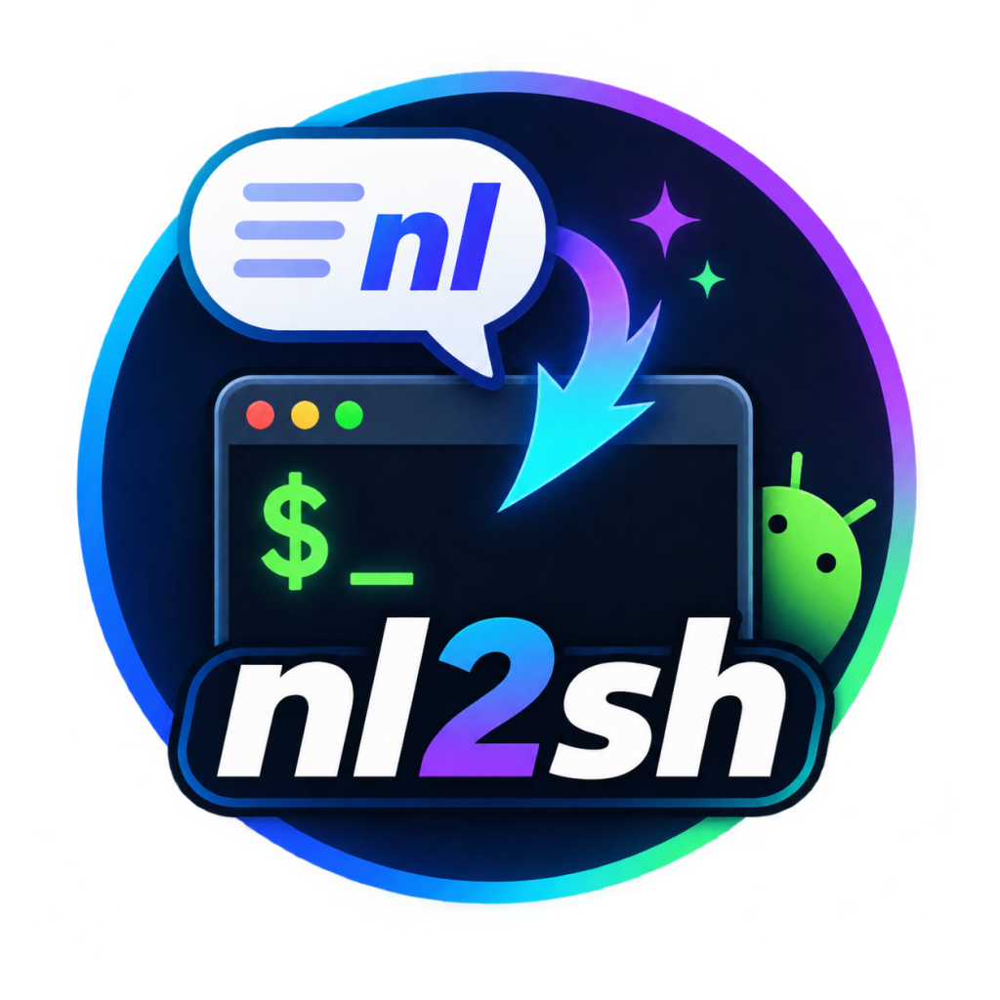

<p align="center"></p>

# nl2sh

[简体中文](README.md) | [English](README_EN.md)

让 AI 在 Android Shell 上完成真实任务。nl2sh 是以 Android 原生 shell 为一等环境、兼容 Termux 的多轮 Tool Calling Agent；单个 Rust 可执行文件内置丰富 TUI 与 Web 多会话界面。

[文档](https://nl2sh.github.io/nl2sh/) · [快速开始](https://nl2sh.github.io/nl2sh/getting-started/) · [Releases](https://github.com/nl2sh/nl2sh/releases/latest)

## 核心能力

- Android API 26+，ARM64/ARMv7/x86_64 原生部署，无需 Termux 或设备端 Rust/Node.js。
- OpenAI 兼容模型、多轮 Agent、流式回答、会话恢复与 @ 文件引用。
- 设备、UI、文件、网络、音频工具，可选 APK/JADX、Tailcat、ima。
- TUI/Web 本地安全分类与确认，Root、用户编辑和模型都不能跳过检查。
- 可选主机侧 A2A/MCP 与 Android companion；“类 Hermes”不承诺 API/插件兼容。

```text
User → Agent → Tool Calling → Security → Confirmation → Android Shell
```

## 快速开始

电脑先安装 adb、开启设备 USB 调试并授权，再下载并校验 [Release ZIP](https://github.com/nl2sh/nl2sh/releases/latest)，完整解压后运行 `android-run-linux.sh` 或 `android-run-windows.bat`。使用 `/config` 配置模型，输入“查看这台设备还剩多少存储空间”。

也可以在 Android 控制端安装 [nl2sh-helper](https://github.com/nl2sh/nl2sh-helper) APK，通过 TCP ADB 或目标设备的无线调试连接，自动部署 ARM64/ARMv7 版 nl2sh 并在浏览器打开 Web 界面。助手仓库和 Release 需要访问权限；详见[安装指引](https://nl2sh.github.io/nl2sh/getting-started/installation/#nl2sh-helper)。

Termux 用户可使用：

```bash
pkg install tur-repo
pkg install nl2sh
nl2sh
```

[完整安装与更新](https://nl2sh.github.io/nl2sh/getting-started/installation/) · [连接模型](https://nl2sh.github.io/nl2sh/getting-started/configure-provider/) · [安全确认](https://nl2sh.github.io/nl2sh/guide/security-confirmation/)

Web 默认监听所有 IPv4 且无需登录，接入者可编辑配置或提交任务；仅在受信任网络使用。APK/JADX 与 Tailcat 默认关闭。


可选 Android 项目：[Android Bridge](https://github.com/nl2sh/android-bridge) · [JADX helper](https://github.com/nl2sh/jadx-helper)，各自独立构建与发布，不包含在本仓库源码内。

## 开发与贡献

需要 stable Rust 与 Node.js 22+ / npm。

```bash
cargo fmt --all -- --check
cargo check
cargo test
```

[构建](https://nl2sh.github.io/nl2sh/development/build/) · [架构](https://nl2sh.github.io/nl2sh/development/architecture/) · [贡献与文档维护](https://nl2sh.github.io/nl2sh/development/contributing/)

正式用户文档唯一事实源是 `docs/zh/` 与 `docs/en/`。用户可感知的代码变化必须在同一 PR 同步对应双语页面；新配置、参数和工具同时更新派生参考。Agent 修改前遵守 [AGENTS.md](AGENTS.md)。内部设计、计划和验证上下文保留在根目录开发文档。

[更新记录](https://nl2sh.github.io/nl2sh/changelog/) · [MIT License](LICENSE) · [Issues](https://github.com/nl2sh/nl2sh/issues)

欢迎 Star、报告问题或贡献代码。[支持项目](https://github.com/nl2sh/nl2sh) · [微信赞赏](https://suqishuo.cn/uploads/wechatpay.png)

[组织项目与集成边界](https://nl2sh.github.io/nl2sh/development/projects/)：区分原生 Agent、A2A/MCP 网关、Android Bridge、JADX helper 与 ADB 安装助手。
