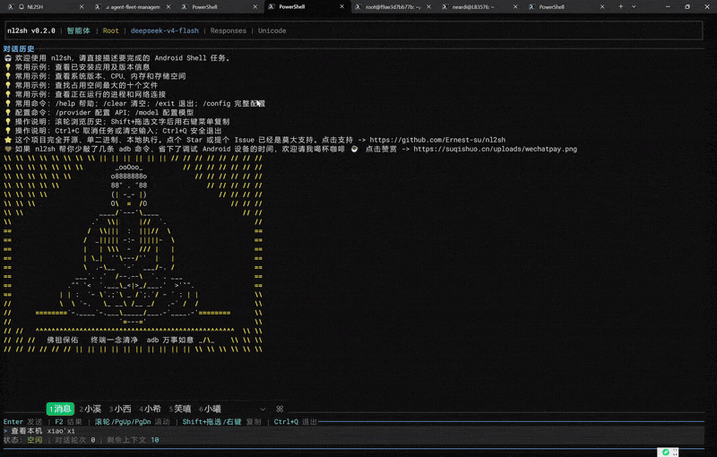
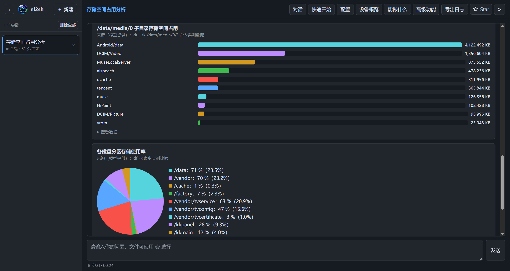

<p align="center">
  
</p>

<h1 align="center">nl2sh</h1>

<p align="center"><a href="README.md">简体中文</a> | <strong>English</strong></p>

Natural Language to Shell is a Hermes-like AI agent built first for the native Android `adb shell` environment, with Termux compatibility. A direct Android deployment is a single executable with no Termux or device-side runtime dependency; Termux users may install it through a package manager. It includes a rich terminal UI and a built-in multi-session Web UI for conversations, live results, safety approvals, session recovery, and configuration.

Natural-language tasks use multi-turn tool calling to connect OpenAI-compatible models to local tools. Every operation that may execute is classified and, when required, confirmed locally before its real result is returned to the model. “Hermes-like” describes the autonomous-agent experience and tool-calling workflow; it does not claim API, plugin, or feature compatibility with Hermes.

The optional host-side [A2A gateway](a2a_gateway/README.md) and stdio MCP adapter let other agents discover and consult nl2sh on a connected device. Unattended A2A/MCP requests cannot approve mutating or dangerous operations.

## Features and safety boundary

- Multi-turn Agent tool calling by default, plus a Command mode that generates a single command.
- A single Android executable with a rich ratatui/crossterm TUI and an embedded multi-session Web UI.
- Streaming model output, live command output, Markdown, syntax highlighting, collapsible tool results, charts, saved sessions, and Chinese/English TUI localization.
- Structured bounded tools for files, Android diagnostics, UI inspection and interaction, screenshots, networking, audio analysis, private agent notes, and charts.
- APK tools inspect ZIP entries and DEX class names in Rust. Single-class decompilation uses a DEX helper through Android `app_process` after strong confirmation.
- `@` file and directory references with completion; referenced content is still read through bounded structured tools.
- OpenRouter, OpenAI, DeepSeek, Moonshot/Kimi, SiliconFlow, Ollama, and custom OpenAI-compatible endpoints.
- Chat Completions and Responses API support with automatic protocol negotiation.
- A `balanced` policy that automatically permits read-only queries, confirms mutations, and strongly confirms dangerous operations.
- The LLM cannot choose the risk level, bypass confirmation, elevate to root, or override timeouts. Edited commands are classified again from the beginning.
- Root, automatic elevation, and normal-user modes. Non-root elevation uses a parameterized `su -c <command>` invocation.
- Android API 26+ is the primary target, with AArch64 and ARMv7 builds. Direct Android shell and Termux are detected at runtime without changing the safety boundary.

The execution boundary is always:

```text
LLM -> Security -> Confirmation -> Execution
```

Commands run through a Unix PTY. Timeouts terminate and reap the entire process group. Interactive full-screen commands temporarily take control of the terminal; RAII guards restore raw mode, the alternate screen, mouse capture, and the cursor on normal and error paths.

## Build

APK archive and DEX indexing tools need no extra runtime. After the first approved `decompile_apk_class` call, nl2sh downloads the SHA-256-pinned [`jadx-helper.jar`](https://github.com/nl2sh/nl2sh/releases/download/v1.0.4/jadx-helper.jar) from the `v1.0.4` GitHub Release and reuses its private cache. Set `NL2SH_JADX_ANDROID_HELPER_PATH` for an offline helper, or set both `NL2SH_JADX_ANDROID_HELPER_URL` (HTTPS) and `NL2SH_JADX_ANDROID_HELPER_SHA256` to override the download. `NL2SH_JADX_CACHE_DIR` selects a custom cache root. A JVM class JAR is rejected.

Development requires stable Rust (edition 2021) and Node.js 22+ with npm. Cargo copies the `web/` source into its output directory, runs `npm ci` and `npm run build`, and embeds the generated assets in the executable.

```bash
cargo build
cargo test
cargo build --release
```

HTTP uses rustls; native-tls is not enabled.

To validate the Web frontend separately:

```bash
cd web
npm ci
npm test
npm run build
```

Generated `web/dist/`, `web/node_modules/`, and Cargo `target/` content are not source-controlled.

## Built-in Web UI

Interactive startup also launches an HTTP server on `0.0.0.0:9999`, or another available port if 9999 is occupied. The startup screen shows the device URL. The Web UI has no authentication and can edit credentials, so only run it on a trusted network.

The Web UI supports concurrent independent Agent sessions, streaming output, approvals, structured follow-up questions, charts, configuration, device overview, safe terminal access, log export, and saved-session recovery. In-progress tasks store bounded redacted checkpoints; after a restart they are shown as interrupted diagnostics and are never automatically resumed or approved.

Quick Start can configure and test DeepSeek, OpenRouter, OpenAI, Moonshot/Kimi, SiliconFlow, Ollama, or a custom service. Each new Web task loads the latest saved configuration. A running TUI session must be restarted to load configuration changed in the browser.

The server uses Tokio and Axum 0.8. Agent state and streaming output use SSE, while the safety terminal uses WebSocket. The Preact/TypeScript/Vite frontend is embedded with `rust-embed`, so the Android release still ships as one ELF executable.

## Android cross-compilation and deployment

Install the Rust target and configure Android NDK r28c or a compatible NDK:

```bash
rustup target add aarch64-linux-android
export ANDROID_NDK_HOME=/path/to/android-ndk
./cross-compile.sh
adb push target/aarch64-linux-android/release/nl2sh /data/local/tmp/
adb shell chmod +x /data/local/tmp/nl2sh
adb shell -t /data/local/tmp/nl2sh
```

The default is API 26 and `aarch64-linux-android`. Set `RUST_TARGET=armv7-linux-androideabi` for a 32-bit ARM device. The device does not need Bash, GNU coreutils, Termux, Rust, Node.js, or npm.

Build, deploy, and launch in one step on Linux:

```bash
export ANDROID_NDK_HOME=/path/to/android-ndk
./android-build-run.sh
```

On Windows, the PowerShell script uses the native Windows NDK toolchain:

```powershell
$env:ANDROID_NDK_HOME = "C:\Android\Sdk\ndk\28.2.13676358"
.\android-build-run.ps1
```

Both launchers select an ADB device, detect its ABI, choose the matching Rust target, and deploy to `/data/local/tmp/nl2sh` by default. Use `ADB_SERIAL` to preselect a device and `ANDROID_DIR` to change the destination directory. They try root adbd first and fall back to `su` without weakening configuration-file permissions.

Prebuilt releases contain both `bin/arm64-v8a/nl2sh` and `bin/armeabi-v7a/nl2sh`. Run `android-run-linux.sh` on Linux or `android-run-windows.bat` on Windows. The launcher compares SHA-256 digests and skips `adb push` when the device already has the same executable. It deploys a configuration only when `NL2SH_CONFIG_SOURCE` is explicitly set.

Bootstrap the latest verified release on Linux:

```bash
export NL2SH_API_KEY='your-api-key'
curl -fsSL https://raw.githubusercontent.com/nl2sh/nl2sh/master/install-android.sh \
  | bash -s -- --provider deepseek --model deepseek-flash
```

After consuming the downloaded script, the Linux installer reconnects the launcher's standard input to the current controlling terminal. The piped form can therefore still allocate an ADB PTY and enter the TUI. In a non-interactive environment without a controlling terminal, installation remains on disk and the script asks you to run `android-run-linux.sh` later from an interactive terminal.

Or on Windows PowerShell:

```powershell
$env:NL2SH_API_KEY = "your-api-key"
& ([scriptblock]::Create((irm https://raw.githubusercontent.com/nl2sh/nl2sh/master/install-android.ps1))) `
  -Provider deepseek -Model deepseek-flash
```

Or from Windows Command Prompt (the batch entry point uses the built-in PowerShell installation core while retaining the interactive CMD console):

```bat
set "NL2SH_API_KEY=your-api-key"
curl.exe -fsSL https://raw.githubusercontent.com/nl2sh/nl2sh/master/install-android.bat -o "%TEMP%\install-nl2sh.bat" && call "%TEMP%\install-nl2sh.bat" --provider deepseek --model deepseek-flash
```

When GitHub access is restricted, explicitly download both the installer and release assets from the [Gitee mirror](https://gitee.com/nl2sh/nl2sh). This is a separate source selection, not a silent fallback after GitHub fails:

```bash
export NL2SH_API_KEY='your-api-key'
curl -fsSL https://gitee.com/nl2sh/nl2sh/raw/master/install-android.sh \
  | bash -s -- --repository https://gitee.com/nl2sh/nl2sh --provider deepseek --model deepseek-flash
```

```powershell
$env:NL2SH_API_KEY = "your-api-key"
& ([scriptblock]::Create((irm https://gitee.com/nl2sh/nl2sh/raw/master/install-android.ps1))) `
  -Repository https://gitee.com/nl2sh/nl2sh -Provider deepseek -Model deepseek-flash
```

```bat
set "NL2SH_API_KEY=your-api-key"
curl.exe -fsSL https://gitee.com/nl2sh/nl2sh/raw/master/install-android.bat -o "%TEMP%\install-nl2sh.bat" && call "%TEMP%\install-nl2sh.bat" --repository https://gitee.com/nl2sh/nl2sh --provider deepseek --model deepseek-flash
```

The installer resolves the latest Gitee tag through its public release API, then downloads and verifies `nl2sh-android.zip` against `SHA256SUMS`. The corresponding release assets must be synchronized to Gitee; mirroring source code alone is insufficient for a prebuilt installation.

Passing a key through the environment avoids storing it in shell history.

### Daily use after installation

Whether you extracted a release manually or used a one-command installer, you do not need to reinstall nl2sh later. Keep the host-side `nl2sh-android` directory, connect the device, confirm that `adb devices` reports it as `device`, and run the launcher from that directory:

Windows users may also rerun the same CMD or PowerShell bootstrap command. When it finds a complete installation, it reuses and launches it instead of failing with “install directory already exists.” Explicit provider, model, or endpoint arguments update only those configuration fields; other TUI settings and an existing API key are preserved.

```bash
cd /path/to/nl2sh-android
./android-run-linux.sh
```

```bat
cd /d C:\path\to\nl2sh-android
android-run-windows.bat
```

The one-command installer creates `./nl2sh-android` or `%CD%\nl2sh-android` under the directory from which it was run. On every launch, the script selects the ADB device again and checks its ABI and root/`su` state. If the device already has the same executable, its matching SHA-256 causes the upload to be skipped. For multiple devices, choose one when prompted or preselect it:

```bash
ADB_SERIAL=192.168.1.20:5555 ./android-run-linux.sh
```

```bat
set "ADB_SERIAL=192.168.1.20:5555"
android-run-windows.bat
```

Normal subsequent launches do not overwrite `/data/local/tmp/config.toml`; settings changed through `/config` in the TUI remain available. Set `NL2SH_CONFIG_SOURCE` only when you intentionally want to redeploy the host copy of `config.toml`:

```bash
cd /path/to/nl2sh-android
NL2SH_CONFIG_SOURCE="$PWD/config.toml" ./android-run-linux.sh
```

```bat
cd /d C:\path\to\nl2sh-android
set "NL2SH_CONFIG_SOURCE=%CD%\config.toml"
android-run-windows.bat
```

In the TUI, type a task and press Enter. Use `/help` for help, `/config` for provider settings, `/sessions` to restore conversations, Ctrl+C to cancel the active task, and Ctrl+Q or `/exit` to exit safely. Run the same launcher again the next time you want to use nl2sh.

## Termux installation

The recommended Termux installation uses the Termux User Repository:

```bash
pkg install tur-repo
pkg install nl2sh
```

The package uses `$XDG_CONFIG_HOME/nl2sh/config.toml` and `$XDG_STATE_HOME/nl2sh`, falling back to `~/.config/nl2sh/config.toml` and `~/.local/state/nl2sh`. Package-manager builds disable in-app self-update; use `pkg upgrade nl2sh`.

The separately maintained signed APT repository and local `.deb` packaging workflow are documented in [Termux使用说明.md](Termux使用说明.md).

## Configuration

Direct Android deployments read `config.toml` next to the resolved executable by default. `--config PATH` has the highest priority, and `NL2SH_CONFIG` overrides the default path. Missing configuration no longer blocks TUI startup; use `/config` or `/setting` to open the settings panel.

```bash
cp config.toml.example config.toml
```

Precedence is CLI arguments, `NL2SH_API_KEY`, the configuration file, and field defaults. New files are created with mode `0600`. Never commit a real API key.

The default provider is OpenRouter at `https://openrouter.ai/api/v1`, with model `openrouter/free`. `api_type = "auto"` tries Responses first and safely falls back to Chat Completions only for protocol incompatibility before useful output has arrived. Authentication failures, rate limits, server errors, timeouts, and partial streams do not trigger protocol switching.

Agent tasks use bounded step, tool-call, and active-time budgets. Confirmation waits do not consume active task time. Repeated actions and stalled progress trigger replanning or termination but never bypass security, confirmation, or root policy.

## Usage

```bash
nl2sh                                      # TUI Agent mode
nl2sh "List the ten largest files in /data" # one-shot Agent request
nl2sh --mode command "Show memory usage"    # generate, classify, and run one command
nl2sh --mode command --dry-run "Show memory usage"
nl2sh --endpoint http://127.0.0.1:11434/v1 --model local --api-type chat_completions "Show system information"
nl2sh --no-pty --ascii
nl2sh update
```

In the TUI, `!command` runs a local command without calling the model, but still passes through the complete security and confirmation chain. `/shell` temporarily opens an ordinary interactive device shell. `/new`, `/clear`, `/config`, `/setting`, `/permission`, `/balance`, `/sessions`, `/update`, `/help`, and `/exit` are local commands and are never sent to the LLM.

Saved sessions contain bounded conversation and tool results, not API keys, proxy passwords, balances, or temporary approvals. Audit logs may contain device information from command output and should be protected accordingly.

## Screenshots

Android TUI conversation:



Storage analysis in the TUI:


Storage charts in the Web UI:



## Testing

```bash
cargo fmt --all -- --check
cargo check
cargo test
cargo build --release
cargo clippy --all-targets -- -D warnings
```

Android smoke testing should cover terminal restoration, read-only commands, mutation confirmation, rejection of destructive commands, normal/auto/root execution, timeouts, cancellation, and both supported LLM API protocols.

## Known limitations

- AArch64 and ARMv7 Android API 26+ builds are supported and have been validated with root/non-root execution, confirmation, timeout, and full-screen terminal scenarios.
- Interactive PTY behavior can still vary across terminal hosts and full-screen applications.
- Responses adaptation covers common function-call structures but cannot guarantee every vendor-specific extension.
- A 32-bit-only ARM device requires the ARMv7 build. Android may misleadingly report `No such file or directory` when a 64-bit binary requests the unavailable `/system/bin/linker64`.

## Support

nl2sh is fully open source, distributed as a single binary, and executes locally. A GitHub Star, issue, or contribution is appreciated: [support the project](https://github.com/nl2sh/nl2sh).

The project is licensed under the [MIT License](LICENSE).

## Documentation

- [新手指南.md](新手指南.md): beginner guide in Simplified Chinese.
- [使用说明.md](使用说明.md): prebuilt-package guide in Simplified Chinese.
- [ARCHITECTURE.md](ARCHITECTURE.md): modules, data flow, safety, execution, and extension architecture.
- [UI_DESIGN.md](UI_DESIGN.md): TUI/Web theme and component specification.
- [AGENTS.md](AGENTS.md): maintenance constraints for AI contributors.
- [PROJECT_PLAN.md](PROJECT_PLAN.md): roadmap and implementation status.
- [PROJECT_STATUS.md](PROJECT_STATUS.md): current validation status and limitations.
- [CHANGELOG.md](CHANGELOG.md): user-visible changes.
