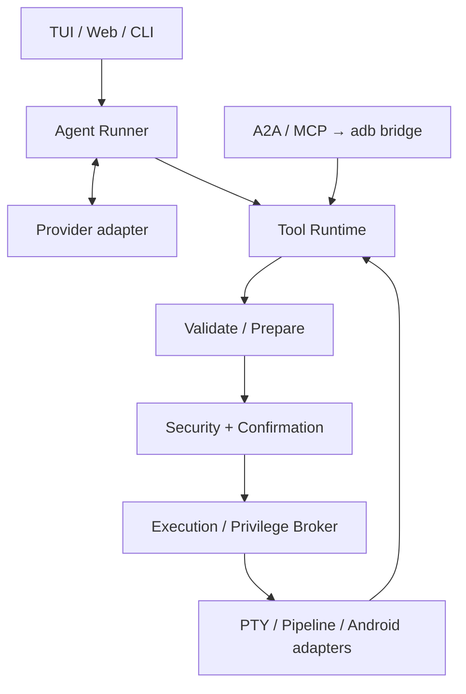

# Architecture

The core ships as one stable Rust 2021 ELF executable. Tokio drives async work, reqwest uses rustls, ratatui/crossterm manages TUI, and Axum/SSE/WebSocket serves embedded Preact Web assets. Python A2A/MCP runs on the host only. Companion APK and JADX DEX helper are optional.

Three logical layers separate Agent planning, named Tool Runtime, and safe platform execution. `bridge invoke` skips the device Agent/model but retains preparation/security/execution; `bridge ask` uses the built-in Agent. Tool results, model history, UI presentation, and audit logs have independent bounds.

## Modules and extension

- `src/agent/`: task loop, history, budgets.
- `src/llm/`: neutral types, Chat/Responses, SSE.
- `src/tools/`: Android/file/audio/network domains, explicit registry, derived schemas.
- `src/security/`: AST shell semantics and domain policy.
- `src/shell/`: Root plans, execution broker, PTY/pipeline, cancellation/restoration.
- `src/config/`, `src/tui/`, `src/web_ui.rs`: configuration and user entry points.
- `a2a_gateway/`, `android-bridge/`, `jadx-helper/`: separate optional modules.

Tools retain prepare → assessment → confirmation → execution. Display components cannot execute Provider JSON. PTY control sequences are filtered, fds/processes use RAII, and failures still wait/restore terminals.

[ARCHITECTURE.md](https://github.com/nl2sh/nl2sh/blob/master/ARCHITECTURE.md) contains internal detailed design; [UI_DESIGN.md](https://github.com/nl2sh/nl2sh/blob/master/UI_DESIGN.md) defines visual constraints. [Plans](https://github.com/nl2sh/nl2sh/blob/master/PROJECT_PLAN.md) and [status](https://github.com/nl2sh/nl2sh/blob/master/PROJECT_STATUS.md) are contributor context rather than user-manual navigation.
