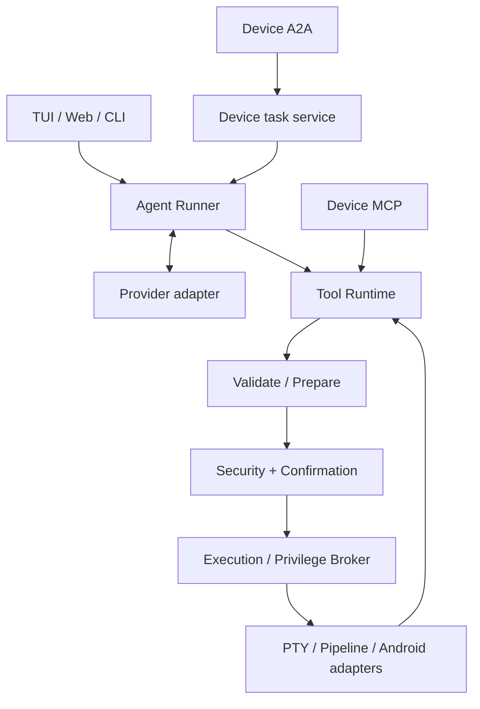

# Architecture

The core ships as one stable Rust 2021 ELF executable. Tokio drives async work, reqwest uses rustls, ratatui/crossterm manages TUI, and Axum/SSE/WebSocket serves embedded Preact Web assets. MCP/A2A runs inside the device executable. Companion APK and JADX DEX helper are optional.

Three logical layers separate Agent planning, named Tool Runtime, and safe platform execution. MCP tools skip Agent/model planning while retaining preparation, security and approval. A2A and MCP ask share the device task service and built-in Agent. Tool results, model history, UI presentation, and audit logs have independent bounds.

## Modules and extension

- `src/agent/`: task loop, history, budgets.
- `src/llm/`: neutral types, Chat/Responses, SSE.
- `src/tools/`: Android/file/audio/network domains, explicit registry, derived schemas.
- `src/security/`: AST shell semantics and domain policy.
- `src/shell/`: Root plans, execution broker, PTY/pipeline, cancellation/restoration.
- `src/config/`, `src/tui/`, `src/web/`: configuration and user entry points.
- `src/protocol/`: device MCP/A2A, persisted tasks, context serialization and local approval. [Android Bridge](https://github.com/nl2sh/android-bridge) and [JADX helper](https://github.com/nl2sh/jadx-helper) are standalone Android projects and Git repositories with independent builds and releases.

Tools retain prepare → assessment → confirmation → execution. Display components cannot execute Provider JSON. PTY control sequences are filtered, fds/processes use RAII, and failures still wait/restore terminals.

[ARCHITECTURE.md](https://github.com/nl2sh/nl2sh/blob/master/ARCHITECTURE.md) contains internal detailed design; [UI_DESIGN.md](https://github.com/nl2sh/nl2sh/blob/master/UI_DESIGN.md) defines visual constraints. [Plans](https://github.com/nl2sh/nl2sh/blob/master/PROJECT_PLAN.md) and [status](https://github.com/nl2sh/nl2sh/blob/master/PROJECT_STATUS.md) are contributor context rather than user-manual navigation.
