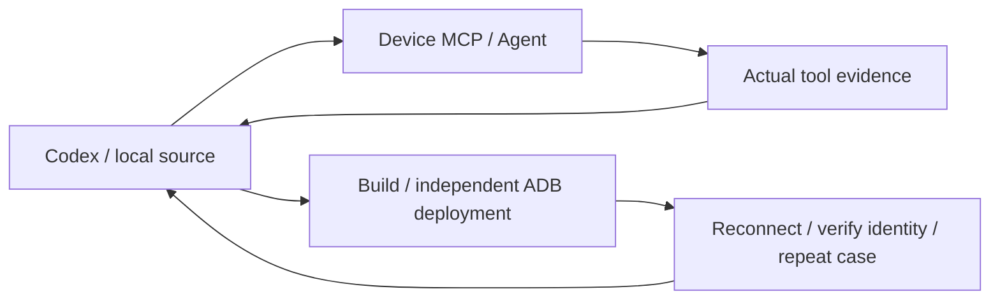

# Codex × Android device development loop

The repository skill `.agents/skills/nl2sh-device-lab/SKILL.md` supports two modes:
Codex calls deterministic device tools through MCP, or delegates open-ended
investigation to the device's nl2sh Agent. Codex owns source changes and decisions;
the device Agent supplies observations and suggestions. It does not edit host
source or commit code. Use an authorized test device or emulator. Delegation also
requires a configured device model provider.



## Build and identity verification

`nl2sh_inspect.build_identity` contains `binary_version`, `git_commit`, `git_dirty`,
`build_id`, `build_target`, `build_profile`, `binary_sha256`, `protocol_version` and
`runtime_uid`. Android API level remains in the existing `api_level` field.
Missing Git information or build IDs are null; matching package versions do not
establish source equivalence. The digest reads `/proc/self/exe`: after atomic
replacement, an old process continues to report its old running image. A blocking
worker performs the read without blocking Tokio. This interface targets Android/Linux.

The host needs Python 3.11+, Git, ADB, stable Rust, Node/npm and an Android NDK.
Create a private results directory outside the repository. Explicitly configure
the device test installation with `protocol_start_with_service = true`, leaving
automatic approval disabled. Never put credentials in cases.

```sh
python3 scripts/device_lab.py build --target x86_64-linux-android --manifest /private/lab/build.json
python3 scripts/device_lab.py deploy --serial emulator-5554 \
  --binary /data/local/tmp/nl2sh-lab/nl2sh --config /data/local/tmp/nl2sh-lab/config.toml \
  --manifest /private/lab/build.json --connection-output /private/lab/connection.json \
  --output /private/lab/deploy.json
python3 scripts/device_lab.py check --connection /private/lab/connection.json \
  --manifest /private/lab/build.json --output /private/lab/identity.json
```

`build` reuses `cross-compile.sh`, supplying a random `NL2SH_BUILD_ID` to distinguish
uncommitted builds. The manifest binds relevant source input digests, Git revision,
target/profile/ID and the final artifact digest. Source changes during compilation
prevent manifest creation. Testing starts only when current sources and the running
image match. The dirty flag describes the build snapshot; later documentation-only
changes do not change the source input digest. Ordinary builds also expose Git,
target and profile, with a null build ID unless `NL2SH_BUILD_ID` is set. An explicit
ID accepts at most 128 ASCII letters, digits, dots, underscores or hyphens.

## Repeatable cases and diagnostic evidence

```sh
python3 scripts/device_lab.py run --connection /private/lab/connection.json \
  --manifest /private/lab/build.json \
  --case .agents/skills/nl2sh-device-lab/assets/environment-smoke.json \
  --output /private/lab/before.json
# After source changes, build/deploy again and run the same case to after.json.
python3 scripts/device_lab.py compare --before /private/lab/before.json \
  --after /private/lab/after.json --output /private/lab/comparison.json
```

JSON case schema 1 defines `id`, `preconditions`, `steps`, `assertions` and `cleanup`.
Preconditions support a minimum Android API and required device tool names. Steps
carry a unique ID, MCP tool name and arguments; discover actual schemas using
`nl2sh_tools`. Assertions locate a value in the MCP result with a JSON Pointer and
compare it using `equals`. `manual_review: true` requires human review and never
passes automatically. Expected failures require a step with `expect_error: true`
and assertions of the specific error evidence. Cleanup calls `nl2sh_invoke` through
normal approval; failures and unexecuted cleanup remain recorded.

`nl2sh_ask` artifacts add `evidence`: up to 64 actual tool observations, linked by
call ID and name, with outputs bounded to 4096 bytes and explicit success, failed
execution, missing result and truncation flags. `output_status` preserves the
completeness status from a structured tool result. Evidence comes from actual ToolRounds,
not facts parsed from model answers, and remains subject to upstream model-visible
result limits. Ordinary conversations need not produce diagnostic JSON. Reports
separate protocol results, assertions, hypotheses, recommendations and limitations.
Use `annotate --report ... --analysis ... --output ...` for reviewed analysis.
Hypotheses require `cause`, `confidence: low|medium|high` and valid
`supporting_evidence` IDs; analysis remains explicitly unverified. Direct evidence
IDs are step IDs; delegated internal observations use `stepID:observationID`.

Long `nl2sh_ask` steps can set `async: true`, obtaining a task ID with A2A
`returnImmediately` and polling only that ID. `--task-timeout` defaults to 600
seconds; expiration requests cancellation and waits for settlement. `--timeout`
controls each HTTP request and defaults to 210 seconds. Disconnects retain known
task IDs without automatic resubmission. Cancellation does not mean rollback.
Reports verify running identity before and after the case; replacing the service
mid-case cannot count as verification of one build.

Outcomes are `pass`, `fail`, `inconclusive` or `manual_review`; only pass exits 0.
Agent COMPLETED status cannot override internal tool failure. Truncated, partial
or missing evidence cannot pass automatically. Different case digests are not
comparable; relevant environment changes require manual review.

## Deployment, recovery and safety

Host ADB control is independent of the MCP process being restarted. Deployment
operates only on the managed service for the specified configuration, checks ABI
and staged digest, atomically replaces the binary and retains the previous file.
Failure attempts rollback and reports its result. Recovery after host crashes is
not transactional; failed rollback needs investigation. Independently started
protocol processes must first be stopped by their owner and are never taken over.
Helper-owned installations are refused; APT installations use the package manager.
Use a dedicated test installation. Scripts never call `adb root` or `su` or change
device configuration or approval policy.

Verified native `service status` and owner Web connection details discover the
actual protocol port and credential. Temporary Web forwards are cleaned up; a
dedicated MCP ADB forward remains for testing. Remove it afterward with
`adb -s SERIAL forward --remove tcp:LOCAL_PORT`, using LOCAL_PORT from the private
connection file. Tokens and ports can change after restart: rediscover and verify
identity before testing again.

Connection files are 0600 and contain a token, excluded from reports and version
control. Reports are 0600, bounded to 4 MiB, and recursively redact known API key
and token environment values. Review other private device data before sharing.
Direct connections accept `--url` and `--token-env`; remote plaintext requires
`--allow-insecure-http`. The helper refuses redirects and expects native JSON HTTP
responses. Native MCP still connects directly to the device; Python is not a
runtime gateway.

Keep `Security → Confirmation → Execution` intact. Mutating and dangerous tools
still require the same-UID device-local interactive approval terminal. Failed
tests never justify enabling unsafe policy, automatic approval or dangerous tools.
Emulator evidence does not replace vendor-device, Root, Termux-permission or other
ABI acceptance testing.

The delegated example is `.agents/skills/nl2sh-device-lab/assets/delegated-smoke.json`. It requires device model configuration; use the same `run` command with this `--case`.
