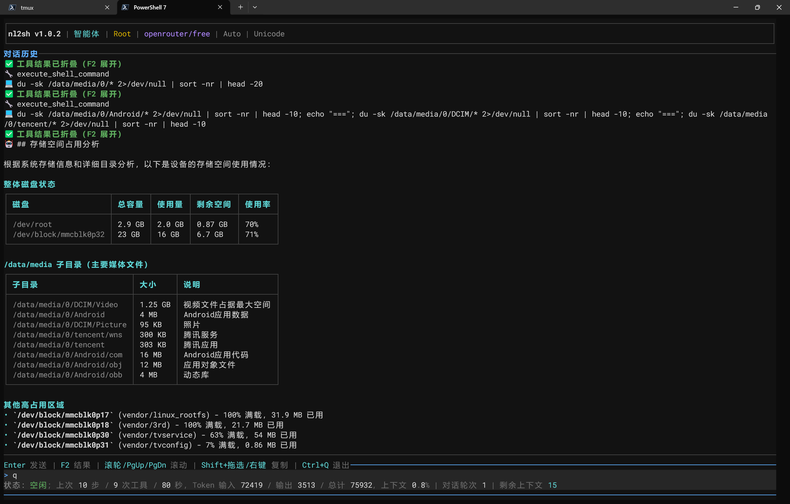

# Terminal UI

Run `nl2sh` without arguments for the multi-turn Agent. Missing configuration still opens the UI, but model tasks require a provider first. Terminal capabilities select TrueColor / ANSI 256; `--ascii` uses ASCII labels.

The startup “MCP / A2A” section shows a protocol-process snapshot, confirmed advertised addresses, HTTP authentication, and device startup/local stdio commands. The TUI does not start protocols; when stopped or unknown, port 8765 URLs are explicitly local examples after default startup. Refresh through `nl2sh --config <config-path> service status` or the Web “MCP / A2A” dialog. See [device MCP/A2A](../advanced/a2a-mcp.md) for connections and local approval.

| Action | Key or command |
| --- | --- |
| Send task | Enter |
| Edit input | Left/Right/Home/End/Delete, UTF-8 safe |
| Input history | Up/Down |
| Scroll history | Wheel, PageUp/PageDown |
| Expand/collapse tools | F2 |
| Cancel task / clear idle input | Ctrl+C |
| Quit safely | Ctrl+Q, `/exit` |
| Settings | `/config`, `/setting` |
| New session / restore | `/new`, `/sessions` |

Ctrl+C cancels a pending model request and returns to idle so you can send another task. Ctrl+Q cancels the current task, completes necessary cleanup, exits, and restores the terminal without waiting for the model request to time out. Pending approval or additional-input requests are rejected or cancelled, and subsequent tools do not execute.

Type `/` for suggestions, select with Up/Down, and complete with Enter. Unknown slash commands never go to the model. Shift+drag and the host terminal context menu copy text; Windows ADB launchers use wheel-to-Up/Down compatibility.

Running tools show bounded live output, then collapse completed results. Replies support Markdown, fenced-code highlighting, Unicode tables, and narrow-screen fallback. The status bar reports observed token use and budgets; missing usage remains unknown. Supported provider balances stay in memory only.

## Local commands

`!id` skips the model but retains security, confirmation, and execution checks. Output is omitted from model context. `/shell` suspends the TUI for an ordinary system shell; `exit` / Ctrl+D returns. Its input/output is omitted from model context and audit logs; this is a shell directly controlled by the user. Full-screen commands temporarily suspend the TUI, then restore the terminal and repaint it.

See [slash commands](../reference/slash-commands.md) and [safety approvals](security-confirmation.md).

## Tool configuration

Open `/config` (or `/setting`) and use Tab/Shift+Tab to select Tools. Up/Down selects an APK/JADX or Tailcat group or an individual tool; Left/Right or Space toggles it. Ctrl+S saves and reloads configuration; Esc discards edits. Long lists follow the selection. Each tool shows its effective enabled state and whether it inherits the group or has an override. Changing a group clears its tool overrides. Both groups default off. Enabling tools does not approve execution: risk classification, Root checks, and confirmation still apply. The ima switch and credentials remain in Knowledge.

## Tailcat shortcut

Enter `/tailcat`. The dialog selects the actual Web port and ADB connection port (automatically detected, falling back to editable 5555) by default. Confirming the selection starts installation and sharing without further safety prompts. It shows download and execution status, then stays open with copyable peer commands. No LLM is used; existing tools handle validation and execution. See [Tailcat](../tools/tailcat.md#tailcat-quick).

Confirming or retrying automatically stops the previous managed Tailcat listener and starts sharing again. The dialog stays open after success or failure until explicitly closed.
