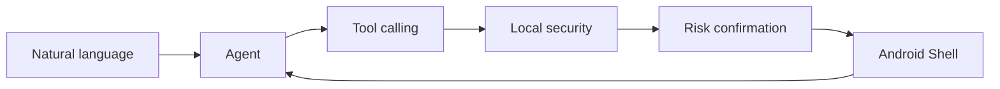

# nl2sh

Let AI complete real tasks in Android Shell.

nl2sh is a multi-turn tool-calling Agent built first for native Android shell, with Termux compatibility. One Rust executable includes a terminal TUI and a multi-session Web UI. Built-in device-native MCP/A2A services connect external agents.

[Get started](getting-started/index.md){ .md-button .md-button--primary }
[Install](getting-started/installation.md){ .md-button }
[GitHub](https://github.com/nl2sh/nl2sh){ .md-button }

## Why nl2sh?

- **Native Android**: API 26+, ADB deployment, no Termux required.
- **Multi-turn Agent**: diagnoses using real tool results and OpenAI-compatible models.
- **TUI + Web**: streaming replies, independent sessions, Markdown, charts, and recovery.
- **Local safety**: classify proposals and confirm by risk; Root retains approvals.
- **Rich tools**: devices, files, networking, audio, optional APK/JADX and Tailcat.
- **Integration**: A2A, HTTP/stdio MCP, and an optional Android companion.

## Start with a read-only task

Try “Show how much storage this device has left” or “Diagnose the network failure without changing settings.” The Agent explains evidence from real queries; changes wait for your decision.

## Next steps

[Choose an installation](getting-started/installation.md) → [Connect a model](getting-started/configure-provider.md) → [Run your first task](getting-started/first-task.md). Chinese is the default site language; the language menu opens the complete English documentation. “Hermes-like” describes the interaction style and does not promise Hermes API, plugin, or feature compatibility.

[Projects and integration boundaries](development/projects.md)
