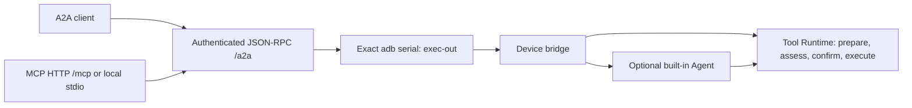

# A2A / MCP protocol reference

The implementation lives in `a2a_gateway/nl2sh_a2a/`, `src/bridge.rs`, `src/bridge/approval.rs` and `src/tools/runtime.rs`. See the [deployment guide](../advanced/a2a-mcp.md) for Python, Docker, Hermes and stdio client setup.

## Execution paths



The gateway targets one configured device. It does not expose generic adb commands or remote approval methods. A registered shell tool can execute commands through the device's normal risk/approval boundary; the narrow transport is not an allowlist of read-only actions. Tool availability follows device configuration, including optional groups and per-tool overrides. Process-managed Tailcat listeners are filtered from the one-shot bridge.

| Endpoint | Access and behavior |
| --- | --- |
| `/.well-known/agent-card.json` | Public discovery; JSON-RPC binding/version `1.0`; streaming and push notifications are disabled |
| `/a2a` | Bearer-authenticated A2A JSON-RPC; send `A2A-Version: 1.0` |
| `/mcp` | Bearer-authenticated Streamable HTTP MCP; same port/token, not legacy `/sse` |
| `nl2sh-a2a-mcp` | Local stdio process; authenticated A2A client, no local adb required |

The token must contain at least 32 characters. The server uses one owner identity for all token holders: task IDs and contexts do not provide isolation between clients. Preserve the SQLite database and protect it, ADB keys and tokens. Gateway tasks and device Agent history are separate stores; retaining one does not restore the other. Persistence does not automatically resume an operation interrupted by gateway restart.

## Gateway configuration

Run `nl2sh-a2a --help` for host CLI options. Device paths refer to Android, not the gateway filesystem.

| Setting | Default / requirement |
| --- | --- |
| `--serial` | Required exact adb serial; only IPv4 `IP:port` triggers automatic reconnect |
| `--binary`, `--config` | `/data/local/tmp/nl2sh`, `/data/local/tmp/config.toml` on the device |
| `--db` | Required SQLite file on the gateway host |
| `--host`, `--port` | `127.0.0.1`, `8765`; accepted hosts: `127.0.0.1`, `localhost`, `0.0.0.0` |
| `--advertised-url` | Defaults to listener HTTP origin; required when binding `0.0.0.0` |
| `--allow-insecure-http` | Explicit network-bind/remote HTTP opt-in, also set by `NL2SH_A2A_ALLOW_INSECURE_HTTP=1` |
| `NL2SH_A2A_TOKEN` | Required shared Bearer token; minimum 32 characters |
| `NL2SH_A2A_URL` | stdio client origin only; defaults to `http://127.0.0.1:8765` |

Binding `0.0.0.0` requires the explicit opt-in even when a reverse proxy advertises HTTPS, because uvicorn itself serves HTTP. HTTPS is terminated by the proxy; do not configure a path prefix in the advertised origin. In Compose, `NL2SH_DEVICE_SERIAL/BINARY/CONFIG` supply device CLI values and `NL2SH_GATEWAY_URL` supplies the advertised origin. `NL2SH_GATEWAY_BIND/PORT` control host port publication; the container continues to listen on 8765. Changing the published port requires updating the URL too. Gateway environment variables do not set device `bridge_auto_approve`; edit the device config separately.

## A2A messages and tasks

`SendMessage` uses `ROLE_USER`, a fresh `messageId` and text parts. The gateway strips surrounding whitespace and dispatches these messages:

| Text | Device operation | Device model required |
| --- | --- | --- |
| `/inspect` | Fixed environment probes | No |
| `/tools` | Currently available tools and schemas | No |
| `/invoke {"tool":"android.screen_dump","arguments":{}}` | One direct registered tool | No |
| Other nonempty text | One built-in Agent turn | Yes |

`/ask` is not a special A2A command: ordinary text invokes consultation. The invoke object must contain exactly `tool` and object-valued `arguments`. Discover the actual device schema before preparing an action.

A read-only JSON-RPC example (POST to `/a2a` with Bearer authentication and `A2A-Version: 1.0`):

```json
{
  "jsonrpc": "2.0",
  "id": "inspect-1",
  "method": "SendMessage",
  "params": {
    "message": {
      "messageId": "unique-message-1",
      "role": "ROLE_USER",
      "parts": [{"text": "/inspect"}]
    }
  }
}
```

The response contains `result.task`. Save its `id` and `contextId`. Query the saved task with `{"jsonrpc":"2.0","id":"lookup-1","method":"GetTask","params":{"id":"TASK_ID"}}`. `GetTask` returns a task directly in `result`. Reuse `contextId` in the next message for Agent follow-ups; the gateway maps it to `a2a-` plus the first 32 hexadecimal characters of its SHA-256. Agent turns sharing that session are serialized within one gateway process. Direct calls do not enter that Agent history, and sharing a context does not serialize direct device actions.

The device JSON result is encoded as text in the `nl2sh_result` artifact, at `task.artifacts[0].parts[0].text`. Parse that text as JSON. `TASK_STATE_COMPLETED` means the gateway returned a device result, not that every device operation succeeded. An exception marks the task failed with a bounded status message. Neither HTTP 200 nor an MCP response alone proves action success.

## MCP tools and result contracts

| Tool | Arguments | Result |
| --- | --- | --- |
| `nl2sh_inspect` | None | Task envelope with environment facts |
| `nl2sh_tools` | None | Task envelope with tool definitions |
| `nl2sh_invoke` | `tool`, object `arguments` | Task envelope with direct result |
| `nl2sh_read_screen` | None | Text summary plus PNG/JPEG MCP image block |
| `nl2sh_ask` | `message`, optional `context_id` | Task envelope with Agent result |
| `nl2sh_get_task` | `task_id` | Saved task envelope |

Structured envelopes contain `task_id`, `context_id`, `state`, and `result` when an artifact exists; failed tasks also expose `error`. Direct results contain `tool`, `success`, bounded string `output`, and optional `attachments`. An `output` string can itself contain JSON; parse it only when appropriate for that tool. Agent results contain `session`, `answer`, `steps`, `tool_calls`, and up to eight bounded `failed_tools` messages. Review failures and obtain fresh device evidence before claiming completion.

`nl2sh_read_screen` invokes `android.read_screen` and requires a successful result with exactly one supported image attachment. Its text summary contains `task_id`, `state`, `tool` and `output`, rather than the full structured envelope. Tools discovery alone does not validate credentials, the ADB connection or a screenshot. HTTP MCP internally uses authenticated ASGI A2A transport; it does not connect back over the network to the advertised origin.

## Approval and operational limits

By default, `invoke` waits for device-local approval when risk requires it; `ask` rejects requests needing approval. Run `bridge approvals` and `bridge approve REQUEST_ID` in a separate interactive device terminal, using the same config/state path and user identity as the bridge process. At most eight approval requests may be pending. The approval window is 120 seconds; dangerous actions require the displayed second phrase. Use a fresh call after rejection, expiry or target changes.

Explicit device `bridge_auto_approve = true` automatically approves all bridge risks for both paths. Parameter validation, classification, command binding and root capability checks remain. This does not affect TUI/Web/CLI approval policy. The token then permits unattended operations at the bridge process's privileges.

| Boundary | Limit |
| --- | --- |
| A2A/MCP message | 1–8192 UTF-8 bytes |
| MCP tool name | 1–128 characters; native bridge also checks byte length |
| MCP context/task identifier | 1–256 characters when supplied |
| Serialized bridge payload | 16 KiB |
| adb stdout and stderr | 3 MiB each, checked while reading |
| MCP client's A2A HTTP reply | 4 MiB, checked while reading |
| MCP screenshot base64 | At most 3 MiB of encoded text, PNG/JPEG only |
| Wireless IPv4 adb connect | 15 seconds, before each operation |
| Device inspect/tools | 30 seconds |
| Device ask/invoke | 180 seconds, including device approval |
| MCP adapter A2A HTTP client | 200-second timeout |

The 200-second value is an HTTP client timeout, not a server-wide request deadline. Configure external clients/reverse proxies with enough time for device execution and approval (the setup guide uses 210 seconds). The adapter disables environment-derived HTTP proxies and redirects. For stdio, `NL2SH_A2A_URL` must be an origin with no path, credentials, query or fragment; its JSON-RPC card must use exactly the same scheme/netloc and `/a2a`. Remote HTTP needs `NL2SH_A2A_ALLOW_INSECURE_HTTP=1`; HTTPS or a loopback SSH tunnel is preferred.

## Troubleshooting and uncertain outcomes

| Symptom | Check |
| --- | --- |
| 401 | Same Bearer token on client and gateway; token environment reaches the stdio process |
| Card works, device tool fails | `adb -s SERIAL get-state`, authorization, device binary and config paths, UID and current wireless connection port |
| Agent Card origin mismatch | Match client origin and `--advertised-url` / `NL2SH_GATEWAY_URL` exactly; do not append `/a2a` or `/mcp` to stdio `NL2SH_A2A_URL` |
| Model provider not configured | Configure the device model for `ask`, or use direct tools |
| Unsupported tool | Refresh `/tools`; check group/individual switches and bridge filtering |
| No pending approval | Use the same device config/state and UID; request may have expired or auto-approval may be enabled |
| UI target stale, partial tree or input failure | Read the current screen, resolve a complete target, check companion service/keyboard and shell/root permissions |
| Timeout, cancellation or lost connection | Query the known task and inspect fresh device state before another write |

The transport never automatically replays a device operation after a lost reply. Killing or cancelling the host adb subprocess is not proof that every device-side action stopped or was rolled back. `GetTask` reads saved state; it does not resume or undo execution. A new message is a new operation: neither a reused context nor message ID is a documented exactly-once guarantee.

Host `workflow prepare|deploy|status` commands are development checkpoints, not remotely advertised tools. `status` reads the checkpoint file, not device health. `deploy` checks the recorded local binary digest and current ABI, then pushes/chmods a separate candidate and runs `--version`; it does not verify the remote file digest or guarantee the candidate path was previously absent. Choose a distinct `--candidate` if an existing candidate must be preserved. See the [deployment guide](../advanced/a2a-mcp.md).
