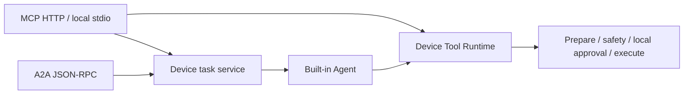

# MCP / A2A protocol reference

Implementation lives in `src/protocol/`: execution reuses Tool Runtime / AgentRunner, tasks handles concurrency and cancellation, store persists device tasks, and mcp/a2a adapt their respective protocols. See the [deployment guide](../advanced/a2a-mcp.md) for startup and clients.

## Entry points and authentication

| Entry | Behavior |
| --- | --- |
| `/.well-known/agent-card.json` | Public Agent Card, A2A JSONRPC 1.0; no A2A streaming, push, or extended card |
| `/a2a` | Bearer authentication, JSON-RPC 2.0, `A2A-Version: 1.0` |
| `/mcp` | Bearer authentication, Streamable HTTP; not legacy SSE `/sse` |
| `nl2sh protocol stdio` | Device-local stdin/stdout MCP under the launching user's privileges |

HTTP is separate from Web. Defaults are `0.0.0.0:8765` and `--allow-insecure-http=true`. The advertised IP comes from IPv4 routing/active interfaces, falling back to loopback; `--advertised-url` overrides the origin used in the Agent Card and Host/Origin checks. Unset `NL2SH_PROTOCOL_TOKEN` generates a 64-character, 256-bit system-random token and prints startup connections. An explicit value must contain 32–256 printable ASCII characters and is not printed. Generated tokens rotate on restart, are stored in the private 0600 protocol announcement for TUI/Web display and are included in task-snapshot redaction. All holders of the token share one trusted owner; there is no multi-tenant task isolation. Task/context IDs are not access credentials. Host must match the advertised authority or local listener address; any supplied Origin must match the advertised origin. Missing/invalid tokens return 401; invalid Host/Origin returns 403. Use `--host 127.0.0.1` for local-only access; `--allow-insecure-http=false` refuses a non-loopback HTTP listener.

MCP uses the official Rust SDK and supports protocol versions `2025-11-25`, `2025-06-18`, and `2024-11-05`. HTTP uses stateless server transport; clients still follow initialize/initialized lifecycle and need not retain `Mcp-Session-Id`. Resources/prompts, remote approvals, sampling, and the MCP Tasks extension are not provided.

## MCP tools

| Tool | Parameters | Result |
| --- | --- | --- |
| `nl2sh_inspect` | None | Fixed device environment object |
| `nl2sh_tools` | None | Object with a `tools` array of available registered tools and parameter schemas |
| `nl2sh_invoke` | `tool`, object `arguments` | Direct tool result, without a model call |
| `nl2sh_read_screen` | None | Text summary and PNG/JPEG MCP image block |
| `nl2sh_ask` | `message`, optional `context_id` | Device Task for the built-in Agent |
| `nl2sh_get_task` | `task_id` | Saved device Task |
| `nl2sh_cancel_task` | `task_id` | Task after requesting cancellation and waiting for settlement |

Direct results contain `tool`, `success`, bounded string `output`, and optional `attachments`. `output` may itself contain JSON text. MCP provides text content and structuredContent; operation failure sets `isError` to true. Successful screen reads require exactly one PNG/JPEG attachment, returned as native MCP image content.

`nl2sh_ask` returns the same Task format as A2A. Agent results contain `session`, `answer`, `steps`, `tool_calls`, and at most eight bounded `failed_tools`, at `artifacts[0].parts[0].data`. COMPLETED means the Agent returned, not that every tool succeeded. Missing model configuration produces a FAILED task. MCP tool discovery does not prove device capabilities; the actual catalog reflects configuration and capability discovery. The long-lived server can expose enabled process-lifetime tools.

## A2A messages, tasks, and pagination

`nl2sh_inspect` adds `build_identity`: compile-time Git/dirty/build ID/target/profile,
running executable SHA-256, protocol version and UID. Missing provenance is null;
matching versions do not prove identical code. `nl2sh_ask` artifacts add `evidence`
derived from actual ToolRounds, linking tool names and call IDs to success, failure,
missing results and bounded output (64 entries, 4096 bytes each), with explicit
truncation and total-call metadata. Model answers remain unverified analysis.
See the [device development loop](../development/device-lab.md).

Accepts `ROLE_USER`, a nonempty `messageId`, and text parts only. Parts join with newlines, totaling 1–8192 UTF-8 bytes. All user text enters the Agent; no slash tool commands are parsed. Omit `contextId` to generate one; reuse it to continue Agent history. Each send creates a new task; continuation with an old `taskId` is unsupported.

| JSON-RPC method | Parameters and behavior |
| --- | --- |
| `SendMessage` | `message`, optional `configuration.returnImmediately/historyLength/acceptedOutputModes`; returns `{task: ...}` |
| `GetTask` | `id`, optional `historyLength`; returns Task directly |
| `ListTasks` | Optional `contextId/status/pageSize/pageToken/historyLength/includeArtifacts/statusTimestampAfter` |
| `CancelTask` | `id`; requests cooperative cancellation and waits for the current operation to settle |

SendMessage waits for terminal status by default; `returnImmediately: true` returns a submitted task for polling. `historyLength: 0` excludes message history. ListTasks defaults to at most 50 items, maximum 100, ordered by update time and ID descending; returns `tasks/totalSize/pageSize/nextPageToken`. The final page token is `""`. Artifacts are omitted unless `includeArtifacts: true`.

Tasks use `id/contextId/status/history/artifacts`. States are `TASK_STATE_SUBMITTED/WORKING/COMPLETED/FAILED/CANCELED`, with RFC3339 timestamps. Artifact `parts[0].data` is structured device output; no nested JSON text needs parsing. Errors follow JSON-RPC and A2A 1.0 mappings, including missing task `-32001`, not cancelable `-32002`, unsupported operation `-32004`, unsupported content type `-32005`, and unsupported version `-32009`.

## Execution, approval, and cancellation

Direct and Agent calls reuse registration, argument validation, preparation, assessment, resource locks, approval, privilege binding, and audit. Permissive remote configuration is raised to at least balanced/risk_only; execution uses captured pipelines. Mutations default to local interactive terminal approval, at most eight requests for 120 seconds; dangerous actions require an exact phrase. No remote approval tool exists. Explicit `protocol_auto_approve` approves all risk levels through the protocol confirmer only.

Agent tasks sharing a context serialize within the service and use an isolated `protocol-` session namespace. Web/TUI do not share that namespace. Android UI operations retain existing cross-process locks. An HTTP disconnect does not automatically replay or roll back A2A tasks; query known tasks before resubmitting. Message IDs do not promise exactly-once execution.

CancelTask/MCP cancellation rejects pending approvals and signals the Agent/captured shell. Execution futures are not directly dropped when client requests end; shell uses existing process-group cleanup, and other tools finish their current operation before stopping. Side effects may already have occurred; CANCELED does not mean rollback. SIGINT/SIGTERM drains tasks through the same boundary before shutdown.

## Storage and limits

The device state directory contains `protocol/tasks.sqlite3`, with directory mode 0700 and file mode 0600. An exclusive process lock prevents multiple protocol servers using the same state directory. Complete Agent history lives privately in `sessions/`. Known configured credentials and service tokens are redacted from task snapshots. Restart changes SUBMITTED/WORKING to FAILED without recovering, replaying, or approving execution; unfinished turns are not saved as complete history.

| Boundary | Limit |
| --- | --- |
| HTTP request body | 32 KiB for MCP/A2A |
| MCP argument JSON | 16 KiB |
| Agent user text | 8192 UTF-8 bytes |
| Tool name | 128 UTF-8 bytes |
| task/context/message ID | 256 UTF-8 bytes |
| Active tasks | 16, including context/approval waits |
| Pending local approvals | 8, 120 seconds |
| Stored task document | 4 MiB |
| Retained tasks | 200 / 64 MiB of documents, pruning oldest terminal tasks first |
| MCP screen base64 | 3 MiB, PNG/JPEG only |

Task storage is not an indefinite archive; older terminal tasks may be pruned. Agent/tool configuration controls execution budgets; there is no shared 180-second ADB timeout. Client/proxy timeouts must cover execution and approval waits. Long Agent delegations should use returnImmediately + GetTask.
