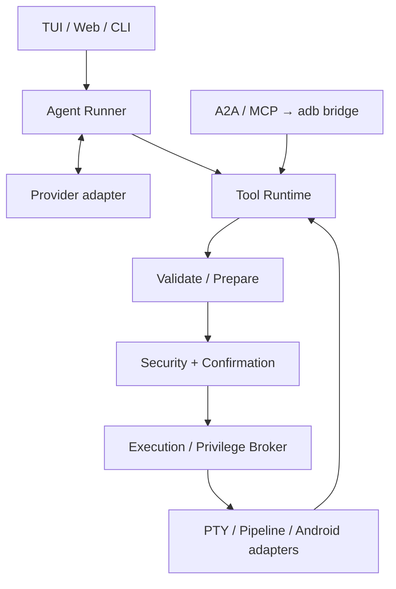

# 架构

核心以 stable Rust 2021 单 ELF 交付；Tokio 驱动异步，reqwest 使用 rustls，ratatui/crossterm 管理 TUI，Axum/SSE/WebSocket 与嵌入的 Preact 页面管理 Web。Python A2A/MCP 仅在主机运行，companion APK 与 JADX DEX helper 都是可选依赖。

逻辑分三层：Agent 规划层、具名 Tool Runtime、安全执行的平台适配层。`bridge invoke` 跳过设备 Agent 和模型请求，但保留准备、安全与执行；`bridge ask` 使用内置 Agent。工具结果、模型历史、UI 显示和审计各自设限。

## 模块与扩展

- `src/agent/`：任务循环、历史与预算。
- `src/llm/`：协议无关类型、Chat/Responses 与 SSE。
- `src/tools/`：按 Android/file/audio/network 等域实现，显式注册表与派生 Schema。
- `src/security/`：AST shell 语义与领域策略。
- `src/shell/`：提权计划、执行 broker、PTY/管道、取消与恢复。
- `src/config/`、`src/tui/`、`src/web_ui.rs`：配置与用户入口。
- `a2a_gateway/`、`android-bridge/`、`jadx-helper/`：独立可选模块。

新增工具必须保持 prepare → assessment → confirmation → execution；显示组件不得直接执行 Provider JSON。PTY 输出过滤终端控制序列，fd 与进程采用 RAII，异常仍 wait 并恢复终端。

内部完整设计见 [ARCHITECTURE.md](https://github.com/nl2sh/nl2sh/blob/master/ARCHITECTURE.md)，视觉约束见 [UI_DESIGN.md](https://github.com/nl2sh/nl2sh/blob/master/UI_DESIGN.md)。[计划](https://github.com/nl2sh/nl2sh/blob/master/PROJECT_PLAN.md)与[项目状态](https://github.com/nl2sh/nl2sh/blob/master/PROJECT_STATUS.md)是贡献者上下文，不作为用户手册导航。
