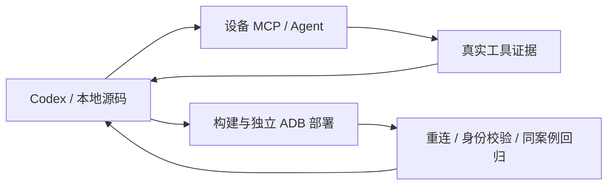

# Codex × Android 实机开发闭环

仓库级 `.agents/skills/nl2sh-device-lab/SKILL.md` 描述两种协作模式：Codex
直接通过 MCP 调用确定性工具，或将开放式诊断委派给设备上的 nl2sh Agent。
Codex 负责源码和决策，设备 Agent 负责观测与建议；设备 Agent 不操作主机源码、
不自动提交。需要已授权的测试设备或模拟器，模型委派另需设备 Provider 配置。



## 构建与身份校验

`nl2sh_inspect` 的 `build_identity` 包含 `binary_version`、`git_commit`、
`git_dirty`、`build_id`、`build_target`、`build_profile`、`binary_sha256`、
`protocol_version` 和 `runtime_uid`。Android API level 在原有 `api_level` 字段。
缺失 Git 或 build ID 时为 null，不把版本号相同当成源码一致。
摘要读取 `/proc/self/exe`，因此原子替换磁盘程序后，旧进程仍报告旧映像摘要。
读取放在阻塞 worker，不阻塞 Tokio；该身份接口面向 Android/Linux。

主机需 Python 3.11+、Git、ADB、stable Rust、Node/npm 和 Android NDK。
先创建仓库外的私有结果目录，将设备配置显式设置为
`protocol_start_with_service = true`，保持自动审批关闭。不要把密钥写入案例。

```sh
python3 scripts/device_lab.py build --target x86_64-linux-android --manifest /private/lab/build.json
python3 scripts/device_lab.py deploy --serial emulator-5554 \
  --binary /data/local/tmp/nl2sh-lab/nl2sh --config /data/local/tmp/nl2sh-lab/config.toml \
  --manifest /private/lab/build.json --connection-output /private/lab/connection.json \
  --output /private/lab/deploy.json
python3 scripts/device_lab.py check --connection /private/lab/connection.json \
  --manifest /private/lab/build.json --output /private/lab/identity.json
```

`build` 复用 `cross-compile.sh`，以随机 `NL2SH_BUILD_ID` 区分未提交构建。
Manifest 关联相关源码输入摘要、Git revision、构建 target/profile/ID 和最终二进制摘要。
编译期间源码变化拒绝生成 manifest；检查当前源码和运行映像均一致后才开始测试。
Git dirty 标记描述构建时快照，后续只改文档不改变相关源码摘要。
普通构建也提供 Git/target/profile，但未设置 `NL2SH_BUILD_ID` 时 ID 为 null。
手工设置的 ID 只能包含至多 128 个 ASCII 字母、数字、点、下划线或连字符。

## 可重复案例与诊断证据

```sh
python3 scripts/device_lab.py run --connection /private/lab/connection.json \
  --manifest /private/lab/build.json \
  --case .agents/skills/nl2sh-device-lab/assets/environment-smoke.json \
  --output /private/lab/before.json
# 修改源码后重新 build、deploy，用同一案例生成 after.json。
python3 scripts/device_lab.py compare --before /private/lab/before.json \
  --after /private/lab/after.json --output /private/lab/comparison.json
```

JSON 案例 schema 1 定义 `id`、`preconditions`、`steps`、`assertions`、`cleanup`。
前置条件支持最低 Android API 与所需工具名；步骤携带唯一 ID、MCP 工具名和参数，
工具名和参数从真实 `nl2sh_tools` 获取。断言通过 JSON Pointer 定位 MCP 结果中的值并
使用 `equals` 比较；人工断言用 `manual_review: true`，不会自动通过。
需要验证预期失败时步骤显式设置 `expect_error: true`，同时断言具体错误事实。
清理步骤调用 `nl2sh_invoke`，仍需正常审批；无法执行和失败均记录。

`nl2sh_ask` 的结果增加 `evidence`：最多 64 条真实工具调用观测，关联 call ID 和名称，
输出最多 4096 bytes，明确 success、执行失败、缺失结果及截断；`output_status` 保留工具结构化结果中的完整性状态。它来自实际 Tool Round，
不是从模型答案解析的事实，仍受模型可见结果的上游限额约束。普通对话无需输出诊断 JSON。
报告单独保留协议结果、断言、假设、建议和限制。使用
`annotate --report ... --analysis ... --output ...` 添加经审核的分析；假设必须含
`cause`、`confidence: low|medium|high` 和有效 `supporting_evidence` ID，模型分析仍标为未验证。
直接步骤的证据 ID 是步骤 ID；委派内部调用为 `步骤ID:观测ID`。

长任务步骤可对 `nl2sh_ask` 设置 `async: true`，通过 A2A `returnImmediately` 获取 task ID，
只轮询该 ID；`--task-timeout` 默认 600 秒，到期请求取消并等待收敛。
HTTP 单请求超时由 `--timeout` 控制，默认 210 秒。断线保留已知 task ID，不自动重发，
取消不代表回滚。报告在案例开始和结束复核运行身份；服务中途替换不得算作同一构建通过。

结果为 `pass`、`fail`、`inconclusive` 或 `manual_review`；仅 pass 返回退出码 0。
内部工具失败不能被 Agent 的 COMPLETED 状态覆盖；截断、部分或缺失证据不能自动通过。
前后案例摘要不同则不可比较，相关环境变化需人工复核。

## 部署、恢复和安全

部署通过主机 ADB 控制，与被重启的 MCP 进程解耦；只操作明确指定配置的受管服务。
脚本检查 ABI、暂存文件摘要并原子替换，保留 previous 二进制；失败尝试恢复并在报告中标明
rollback 结果。主机崩溃期间的恢复不保证事务性；失败回滚需人工调查。独立启动的协议进程
必须先由所有者停止，脚本不接管。Helper-owned 安装拒绝替换；APT 安装使用包管理器，
本流程使用专用测试安装。脚本不调用 `adb root`、`su`，不改变设备配置或审批策略。

通过已验证原生 `service status` 与所有者 Web 连接信息发现实际协议端口和令牌。
临时 Web 转发自动清理；专用 MCP ADB forward 保留用于后续测试，结束后通过
`adb -s SERIAL forward --remove tcp:LOCAL_PORT` 移除，LOCAL_PORT 来自私有连接文件。
重启后令牌和端口可能变化，重新发现并验证身份再测试。

连接文件 0600 且含令牌，不进入报告或版本控制。报告 0600、最多 4 MiB，已知 API key/token
环境值递归脱敏；其他设备私密内容仍需分享前审查。直连可用 `--url` 和 `--token-env`，
远端明文须显式 `--allow-insecure-http`；helper 不跟随重定向，仅接受原生 JSON HTTP 回复。
原生 MCP 仍直接连接设备，Python helper 不是运行时网关。

默认保留完整 `Security → Confirmation → Execution`；修改和危险工具仍由设备同 UID
交互终端审批，测试失败不能成为开放 unsafe、自动审批或危险工具的理由。
模拟器验证不代替厂商真机、Root、Termux 权限和其他 ABI 的验收。

委派示例位于 `.agents/skills/nl2sh-device-lab/assets/delegated-smoke.json`，需要设备端模型配置；使用与确定性案例相同的 `run` 命令替换 `--case`。
