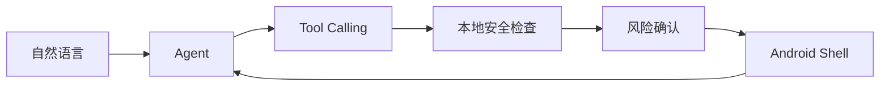

# nl2sh

让 AI 在 Android Shell 上完成真实任务。

nl2sh 是以原生 Android shell 为一等环境、兼容 Termux 的多轮 Tool Calling Agent。核心程序是单个 Rust 可执行文件，内置终端 TUI 与 Web 多会话界面；内置设备端 MCP/A2A 服务连接其他 Agent。

[快速开始](getting-started/index.md){ .md-button .md-button--primary }
[安装](getting-started/installation.md){ .md-button }
[GitHub](https://github.com/nl2sh/nl2sh){ .md-button }

## 为什么使用 nl2sh？

- **Android 原生**：API 26+，直接通过 ADB 部署，无需 Termux。
- **多轮 Agent**：根据真实工具结果继续诊断，支持 OpenAI 兼容模型。
- **TUI + Web**：流式回答、独立会话、Markdown、图表与历史恢复。
- **本地安全**：模型建议先分类，再按风险确认；Root 不跳过审批。
- **丰富工具**：设备、文件、网络、音频，可选 APK/JADX 与 Tailcat。
- **开放接入**：A2A、HTTP/stdio MCP，以及可选 Android companion。

## 从一个只读任务开始

试试“查看这台设备还剩多少存储空间”，或“检查为什么网络连接失败，先不要修改设置”。Agent 根据真实查询解释证据，修改操作等待你的决定。

## 下一步

[选择安装方式](getting-started/installation.md) → [连接模型](getting-started/configure-provider.md) → [完成第一个任务](getting-started/first-task.md)。网站默认中文，语言菜单可切换完整英文文档。“类 Hermes”描述交互形态，不承诺 Hermes API、插件或功能兼容。

[项目与集成边界](development/projects.md)
