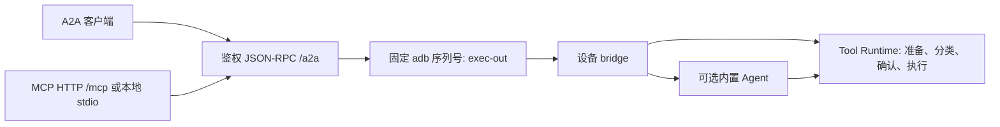

# A2A / MCP 协议参考

实现位于 `a2a_gateway/nl2sh_a2a/`、`src/bridge.rs`、`src/bridge/approval.rs` 和 `src/tools/runtime.rs`。Python、Docker、Hermes 和 stdio 客户端设置见 [部署指南](../advanced/a2a-mcp.md)。

## 执行路径



网关固定连接一台设备，不公开通用 adb 命令或远程批准方法。注册的 shell 工具仍可经过设备安全/审批链执行命令，受限传输并不是只读动作白名单。工具可用性由设备配置决定，包括可选组与单工具开关；一次性 bridge 会过滤依赖当前进程保持的 Tailcat 监听器。

| 端点 | 访问与行为 |
| --- | --- |
| `/.well-known/agent-card.json` | 公开发现；JSON-RPC binding/version 为 `1.0`；不支持流式与推送通知 |
| `/a2a` | Bearer 鉴权的 A2A JSON-RPC；发送 `A2A-Version: 1.0` |
| `/mcp` | Bearer 鉴权的 Streamable HTTP MCP，共用端口/令牌，不是旧 `/sse` |
| `nl2sh-a2a-mcp` | 本地 stdio 进程，作为鉴权 A2A 客户端，无需本机 adb |

令牌至少 32 字符。所有令牌持有者共用一个 owner 身份，任务 ID 和上下文不提供客户端隔离。保留 SQLite 数据库并保护数据库、ADB 密钥和令牌。网关任务与设备 Agent 历史分别保存，只保留其中一个不能恢复另一个；持久化不会自动恢复网关重启中断的操作。

## 网关配置

主机 CLI 选项见 `nl2sh-a2a --help`；设备路径属于 Android，不是网关主机文件。

| 设置 | 默认值 / 要求 |
| --- | --- |
| `--serial` | 必填精确 adb 序列号，仅 IPv4 `IP:port` 自动重连 |
| `--binary`、`--config` | 设备 `/data/local/tmp/nl2sh`、`/data/local/tmp/config.toml` |
| `--db` | 必填，网关主机上的 SQLite 文件 |
| `--host`、`--port` | `127.0.0.1`、`8765`；接受 `127.0.0.1`、`localhost`、`0.0.0.0` |
| `--advertised-url` | 默认监听器 HTTP origin，监听 `0.0.0.0` 时必填 |
| `--allow-insecure-http` | 显式网络监听/远程 HTTP 开关，也可设置 `NL2SH_A2A_ALLOW_INSECURE_HTTP=1` |
| `NL2SH_A2A_TOKEN` | 必填共享 Bearer 令牌，至少 32 字符 |
| `NL2SH_A2A_URL` | 仅 stdio 客户端 origin，默认 `http://127.0.0.1:8765` |

即使反向代理公告 HTTPS，监听 `0.0.0.0` 也需显式开关，因为 uvicorn 本身提供 HTTP。由代理终止 HTTPS，公告 origin 不设置路径前缀。Compose 中 `NL2SH_DEVICE_SERIAL/BINARY/CONFIG` 对应设备 CLI 值，`NL2SH_GATEWAY_URL` 对应公告 origin；`NL2SH_GATEWAY_BIND/PORT` 控制宿主发布端口，容器仍监听 8765，改变发布端口时同步更新 URL。网关环境变量不设置设备 `bridge_auto_approve`，需另行编辑设备配置。

## A2A 消息与任务

`SendMessage` 使用 `ROLE_USER`、新的 `messageId` 与 text parts。网关去除首尾空白后按以下规则分发：

| 文本 | 设备操作 | 需要设备模型 |
| --- | --- | --- |
| `/inspect` | 固定环境探测 | 否 |
| `/tools` | 当前工具及 Schema | 否 |
| `/invoke {"tool":"android.screen_dump","arguments":{}}` | 一次直接注册工具调用 | 否 |
| 其他非空文本 | 一轮内置 Agent | 是 |

`/ask` 不是特殊 A2A 命令，普通文本即进入咨询。invoke 对象必须恰好包含 `tool` 和对象类型的 `arguments`；准备动作前先获取设备实际 Schema。

只读 JSON-RPC 示例（POST 到 `/a2a`，附 Bearer 鉴权和 `A2A-Version: 1.0`）：

```json
{
  "jsonrpc": "2.0",
  "id": "inspect-1",
  "method": "SendMessage",
  "params": {
    "message": {
      "messageId": "unique-message-1",
      "role": "ROLE_USER",
      "parts": [{"text": "/inspect"}]
    }
  }
}
```

响应包含 `result.task`，保存其 `id` 与 `contextId`。查询使用 `{"jsonrpc":"2.0","id":"lookup-1","method":"GetTask","params":{"id":"TASK_ID"}}`，`GetTask` 在 `result` 直接返回 task。Agent 续问在下一条 message 复用 `contextId`；网关将其映射为 `a2a-` 加 SHA-256 前 32 位十六进制。同一网关进程内该会话的 Agent 回合串行化；直接调用不进入 Agent 历史，共用 context 也不会使直接设备动作串行化。

设备 JSON 结果编码为 `nl2sh_result` artifact 中的文本，位于 `task.artifacts[0].parts[0].text`，需再解析为 JSON。`TASK_STATE_COMPLETED` 只表示网关返回了设备结果，不保证每项设备操作成功。异常会将任务标为失败并提供有界状态消息。HTTP 200 或收到 MCP 回复本身均不能证明操作成功。

## MCP 工具与结果契约

| 工具 | 参数 | 结果 |
| --- | --- | --- |
| `nl2sh_inspect` | 无 | 任务封装及环境事实 |
| `nl2sh_tools` | 无 | 任务封装及工具定义 |
| `nl2sh_invoke` | `tool`、对象 `arguments` | 任务封装及直接结果 |
| `nl2sh_read_screen` | 无 | 文本摘要及 PNG/JPEG MCP 图像块 |
| `nl2sh_ask` | `message`、可选 `context_id` | 任务封装及 Agent 结果 |
| `nl2sh_get_task` | `task_id` | 已保存任务封装 |

结构化封装包含 `task_id`、`context_id`、`state`，有 artifact 时包含 `result`；失败任务还提供 `error`。直接结果包含 `tool`、`success`、有界字符串 `output` 及可选 `attachments`；`output` 可能自身是 JSON 字符串，按该工具约定解析。Agent 结果包含 `session`、`answer`、`steps`、`tool_calls`，以及最多八条有界 `failed_tools`。宣称完成前查看失败并取得新的设备证据。

`nl2sh_read_screen` 调用 `android.read_screen`，要求成功且恰有一个支持的图像附件。文本摘要只有 `task_id`、`state`、`tool`、`output`，不是完整结构化任务封装。发现工具不等于验证令牌、ADB 或截图能力。HTTP MCP 通过进程内鉴权 ASGI A2A 调用，不通过网络回连公告 origin。

## 审批与运行限制

默认情况下，`invoke` 在风险要求时等待设备本地批准，`ask` 拒绝待批准操作。在另一个设备交互终端运行 `bridge approvals` 和 `bridge approve REQUEST_ID`，使用与 bridge 进程相同的配置/状态路径及用户身份。最多同时八个待决请求，审批窗口 120 秒；危险操作需输入展示的二次确认短语。拒绝、过期或目标变化后应重新调用。

设备显式设置 `bridge_auto_approve = true` 后，两条 bridge 路径都会自动批准全部风险。参数校验、风险分类、命令绑定与 root 能力检查仍执行，不影响 TUI/Web/CLI 审批策略。此时令牌可触发以 bridge 进程权限运行的无人值守操作。

| 边界 | 限制 |
| --- | --- |
| A2A/MCP 消息 | 1–8192 UTF-8 bytes |
| MCP 工具名称 | 1–128 字符，原生 bridge 另检查字节长度 |
| MCP context/task ID | 提供时 1–256 字符 |
| 序列化 bridge payload | 16 KiB |
| adb stdout、stderr | 分别 3 MiB，边读取边检查 |
| MCP 客户端 A2A HTTP 回复 | 4 MiB，边读取边检查 |
| MCP 截图 base64 | 编码文本最多 3 MiB，仅 PNG/JPEG |
| 无线 IPv4 adb connect | 每次操作前，15 秒 |
| 设备 inspect/tools | 30 秒 |
| 设备 ask/invoke | 180 秒，包含设备审批等待 |
| MCP 适配器 A2A HTTP 客户端 | 200 秒超时 |

200 秒是 HTTP 客户端超时，不是服务端统一请求总时限。外部客户端/反向代理需给设备执行与审批留足时间（接入示例使用 210 秒）。适配器禁用环境 HTTP 代理和重定向。stdio 的 `NL2SH_A2A_URL` 必须是没有路径、凭据、query 或 fragment 的 origin；卡片中的 JSON-RPC 地址必须使用完全相同的 scheme/netloc 和 `/a2a`。远程 HTTP 需 `NL2SH_A2A_ALLOW_INSECURE_HTTP=1`；优先 HTTPS 或 loopback SSH 隧道。

## 排障与不确定结果

| 现象 | 检查 |
| --- | --- |
| 401 | 客户端与网关 Bearer 令牌一致，环境变量传入 stdio 进程 |
| 卡片可访问，设备工具失败 | `adb -s SERIAL get-state`、授权、设备程序/配置路径、UID 和当前无线连接端口 |
| 卡片 origin 不一致 | 客户端 origin 与 `--advertised-url` / `NL2SH_GATEWAY_URL` 完全一致；stdio `NL2SH_A2A_URL` 不追加 `/a2a` 或 `/mcp` |
| 模型未配置 | 为 `ask` 配置设备模型，或改用直接工具 |
| 不支持工具 | 重新获取 `/tools`，检查组/单工具开关及 bridge 过滤 |
| 没有待决审批 | 核对设备配置/状态路径及 UID，请求可能已过期或启用了自动审批 |
| UI 目标过期、部分树或输入失败 | 重读屏幕，取得完整目标，检查 companion 服务/键盘及 shell/root 权限 |
| 超时、取消或连接丢失 | 查询已知任务，重新检查设备状态后再决定是否写入 |

传输不会在丢失回复后自动重放设备操作。终止或取消主机 adb 子进程不能证明所有设备动作已停止或回滚。`GetTask` 只读已保存状态，不恢复或撤销执行。新消息是新操作，复用 context 或 message ID 都没有已承诺的 exactly-once 保证。

主机 `workflow prepare|deploy|status` 是开发检查点，不是远程公布的工具。`status` 读取检查点文件，不探测设备健康。`deploy` 校验记录的本地程序摘要和当前 ABI，然后推送/chmod 独立候选程序并运行 `--version`；它不校验远端文件摘要，也不保证候选路径此前不存在。如需保留旧候选，使用不同的 `--candidate`。见 [部署指南](../advanced/a2a-mcp.md)。
