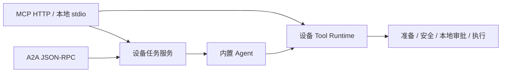

# MCP / A2A 协议参考

实现位于 `src/protocol/`：execution 复用 Tool Runtime / AgentRunner，tasks 管理并发与取消，store 保存设备任务，mcp 与 a2a 分别适配协议。启动和客户端设置见 [部署指南](../advanced/a2a-mcp.md)。

## 入口与鉴权

| 入口 | 行为 |
| --- | --- |
| `/.well-known/agent-card.json` | 公开 Agent Card，A2A JSONRPC 1.0；不支持 A2A 流式、推送或扩展卡片 |
| `/a2a` | Bearer 鉴权，JSON-RPC 2.0，`A2A-Version: 1.0` |
| `/mcp` | Bearer 鉴权，Streamable HTTP；不是旧 SSE `/sse` |
| `nl2sh protocol stdio` | 设备本地 stdin/stdout MCP，使用启动用户权限 |

HTTP 服务与 Web 独立。默认监听 `0.0.0.0:8765`，`--allow-insecure-http=true`。公告 IP 从 IPv4 路由/活动网卡自动获取，找不到时回退本机；`--advertised-url` 可覆盖给 Agent Card 与 Host/Origin 校验使用的 origin。未设 `NL2SH_PROTOCOL_TOKEN` 时生成 64 字符、256 bit 系统随机令牌并打印启动连接信息；设置时要求 32–256 个可打印 ASCII 字符且不打印值。自动令牌重启即换，在运行期间以 0600 权限保存到协议公告以供 TUI/Web 显示，并加入任务快照脱敏。所有持有同一令牌的调用者共享同一个可信所有者，不提供多租户任务隔离；task/context ID 不是访问凭据。Host 必须匹配公告 authority 或本地监听地址；有 Origin 时必须匹配公告 origin。缺少/错误令牌返回 401，错误 Host/Origin 返回 403。只需本机可用时设置 `--host 127.0.0.1`；`--allow-insecure-http=false` 拒绝非本机 HTTP 监听。

MCP 使用官方 Rust SDK；支持 `2025-11-25`、`2025-06-18`、`2024-11-05` 协议版本。HTTP 使用无服务器会话模式，客户端仍按协议执行 initialize/initialized 生命周期；无须保存 `Mcp-Session-Id`。服务不提供 MCP resources/prompts、远程审批、采样或 MCP Tasks 扩展。

## MCP 工具

| 工具 | 参数 | 返回 |
| --- | --- | --- |
| `nl2sh_inspect` | 无 | 固定设备环境对象 |
| `nl2sh_tools` | 无 | 对象，其 `tools` 为当前注册工具及参数 Schema 数组 |
| `nl2sh_invoke` | `tool`、对象 `arguments` | 直接工具结果，不调用模型 |
| `nl2sh_read_screen` | 无 | 文本摘要、PNG/JPEG MCP image block |
| `nl2sh_ask` | `message`、可选 `context_id` | 内置 Agent 的设备 Task |
| `nl2sh_get_task` | `task_id` | 保存的设备 Task |
| `nl2sh_cancel_task` | `task_id` | 请求取消后等待操作结束的 Task |

直接工具结果含 `tool`、`success`、有界字符串 `output` 与可选 `attachments`；`output` 可能自身是 JSON 字符串。MCP 同时提供 text content 和 structuredContent，操作失败将 `isError` 设为 true。截图成功必须恰有一个 PNG/JPEG 附件，作为原生 MCP 图像返回。

`nl2sh_ask` 返回的 Task 与 A2A 共享格式。Agent 结果包含 `session`、`answer`、`steps`、`tool_calls`、最多八条有界 `failed_tools`，位于 `artifacts[0].parts[0].data`。Task 为 COMPLETED 只表示 Agent 已返回；不保证每个工具成功。缺少模型时 task 为 FAILED。发现 MCP 工具不等于设备工具可用；实际目录由配置与能力快照决定。常驻服务可以提供配置允许的进程生命周期工具。

## A2A 消息、任务与分页

`nl2sh_inspect` 新增 `build_identity`（编译 Git/dirty/build ID/target/profile、
运行可执行文件 SHA-256、协议版本和 UID）。缺失 provenance 字段为 null；
同版本号不证明同一代码。`nl2sh_ask` artifact 新增 `evidence`，从真实 Tool Round
关联工具名、call ID、成功/失败/缺失与有界输出，最多 64 项、每项 4096 bytes，
显式报告截断和总调用数。模型答案仍为未验证分析。详见[实机开发闭环](../development/device-lab.md)。

仅接受 `ROLE_USER`、非空 `messageId`、text parts；各段用换行连接，总计 1–8192 UTF-8 bytes。所有用户文本都进入内置 Agent，不解析工具斜杠命令。`contextId` 可省略，由服务生成；复用相同 context 继续 Agent 历史。每次发送创建新 task，不接受携带旧 `taskId` 的任务续接。

| JSON-RPC 方法 | 参数与行为 |
| --- | --- |
| `SendMessage` | `message`、可选 `configuration.returnImmediately/historyLength/acceptedOutputModes`；结果为 `{task: ...}` |
| `GetTask` | `id`、可选 `historyLength`；结果直接为 Task |
| `ListTasks` | 可选 `contextId/status/pageSize/pageToken/historyLength/includeArtifacts/statusTimestampAfter` |
| `CancelTask` | `id`；请求协作取消并等待当前操作结束 |

默认 SendMessage 等待最终状态；`returnImmediately: true` 返回已提交任务，可用 GetTask 轮询。`historyLength: 0` 不返回消息历史。ListTasks 默认最多 50 项、最大 100，按更新时间和 ID 倒序，返回 `tasks/totalSize/pageSize/nextPageToken`；最后一页 token 为 `""`。默认省略 artifacts，`includeArtifacts: true` 才返回。

Task 使用 `id/contextId/status/history/artifacts`。状态为 `TASK_STATE_SUBMITTED/WORKING/COMPLETED/FAILED/CANCELED`；状态 timestamp 使用 RFC3339。artifact 的 `parts[0].data` 是结构化设备结果，无需解析嵌套 JSON 文本。错误使用标准 JSON-RPC 和 A2A 1.0 错误码，例如任务不存在 `-32001`、不可取消 `-32002`、不支持操作 `-32004`、不支持输入类型 `-32005`、版本不支持 `-32009`。

## 执行、审批与取消

直接调用与 Agent 调用都复用工具注册、参数校验、准备、风险评估、资源锁、确认、权限绑定和审计。远程宽松配置提升至至少 balanced/risk_only；执行使用捕获式管道。默认修改等待设备本地交互终端审批，最多八个请求、120 秒；危险类需要精确短语。协议不提供批准工具。显式 `protocol_auto_approve` 可自动批准所有风险等级，仅影响协议确认器。

同一 context 的 Agent 任务在服务内串行处理，并使用独立的 `protocol-` 会话名；Web/TUI 会话不复用该命名空间。Android UI 互斥仍使用现有跨进程锁。HTTP 请求断连不自动重放或回滚 A2A 任务；查询已知 task 后再决定是否重新提交。message ID 不提供 exactly-once 保证。

CancelTask/MCP 取消会拒绝待审批动作，并给 Agent/捕获式 shell 传递取消信号。执行 Future 不因客户端请求结束而被直接丢弃；shell 沿现有进程组回收链停止，其他工具在当前操作完成后结束。取消期间可能已有副作用，CANCELED 不表示回滚。SIGINT/SIGTERM 按相同边界等待任务结束后关闭服务。

## 存储与限制

任务库为设备状态目录下 `protocol/tasks.sqlite3`，目录 0700、文件 0600；进程锁防止同状态目录启动多个协议服务。Agent 完整历史在 `sessions/` 私有目录。已知配置凭据与服务令牌从任务快照脱敏。重启将 SUBMITTED/WORKING 标为 FAILED，不恢复、重放或批准执行；未完成回合不作为完整历史保存。

| 边界 | 上限 |
| --- | --- |
| HTTP 请求体 | 32 KiB，MCP/A2A |
| MCP 参数 JSON | 16 KiB |
| Agent 用户文本 | 8192 UTF-8 bytes |
| 工具名 | 128 UTF-8 bytes |
| task/context/message ID | 256 UTF-8 bytes |
| 活动任务 | 16，包括等待上下文/审批 |
| 待决本地审批 | 8，120 秒 |
| 单任务存储文档 | 4 MiB |
| 保存任务 | 200 / 文档总量 64 MiB，先清理最旧终态任务 |
| MCP 截图 base64 | 3 MiB，仅 PNG/JPEG |

Task 存储不是无限期归档，旧终态任务可能被清理。执行时间由配置中的 Agent 与工具预算控制，没有统一 180 秒 ADB 超时；客户端与反向代理超时应覆盖任务时长和审批等待，长期 Agent 委派建议 returnImmediately + GetTask。
