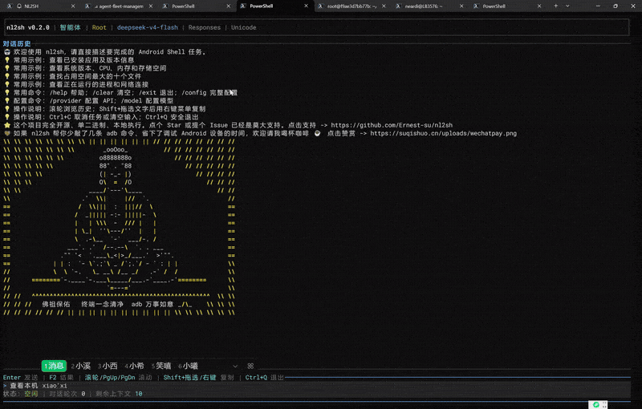

# nl2sh 用户使用说明

nl2sh 是 Android shell 版的类 Hermes AI Agent，通过丰富的终端界面用自然语言完成 Android 任务。核心程序只有一个可执行文件，运行在 Android 设备上，但需要从 Linux 或 Windows 电脑通过 ADB 启动。不需要安装 Rust、Android NDK 或 Termux。

## 1. 使用前准备

1. 在电脑上安装 Android SDK Platform-Tools，并确保命令行能运行 `adb`。
2. 在 Android 设备的“开发者选项”中开启“USB 调试”。
3. 用 USB 或网络 ADB 连接设备。设备弹出“是否允许 USB 调试”时，选择允许。
4. 在电脑上检查连接：

   ```text
   adb devices
   ```

   设备序列号后面显示 `device` 才表示已连接。如果显示 `unauthorized`，请解锁设备并允许调试授权。

## 2. 下载并解压

下载 `nl2sh-android.zip` 或 `nl2sh-android.tar.gz`。同一个压缩包已经包含 64 位和 32 位 ARM 程序：

```text
nl2sh-android/
├── bin/arm64-v8a/nl2sh
├── bin/armeabi-v7a/nl2sh
├── android-run-linux.sh
└── android-run-windows.bat
```

启动脚本会通过 ADB 查询设备 ABI 并自动推送对应程序，不需要用户选择 32/64 位压缩包。请完整解压，不要单独移动脚本或 `bin` 目录。

## 3. Linux 用户

打开终端，进入解压后的文件夹，运行：

```bash
chmod +x android-run-linux.sh bin/arm64-v8a/nl2sh bin/armeabi-v7a/nl2sh
./android-run-linux.sh
```

脚本会选择 ADB 设备、检测 32/64 位、复制对应的 `nl2sh` 并启动。

## 4. Windows 用户

完整解压后，双击 `android-run-windows.bat` 即可运行。也可以在命令提示符中执行：

```bat
android-run-windows.bat
```

不需要 PowerShell、WSL、Rust 或 Android NDK。

Linux 和 Windows 脚本采用相同的设备选择流程：没有已连接设备时提示输入 IP（可带端口，默认由 ADB 处理）；只有一台设备时自动选择；有多台设备时列出编号供选择。随后脚本直接查询所选设备的 ABI，并使用压缩包内匹配的程序。

## 5. 首次启动

所有以 `/` 开头的 TUI 输入均为本地命令，未知命令不会发送给模型。

首次启动会直接进入 nl2sh TUI，不会自动打开配置向导。请使用 `/config` 或别名 `/setting` 打开统一设置面板。完成配置前，普通任务不会发送给模型。

- 输入任务后按 Enter，例如：`查看当前内存使用情况`。
- 修改设备的命令需要用户确认；高危命令需要二次确认。请仔细阅读命令再同意执行。
- 输入 `/help` 可显示操作帮助。
- 输入 `/clear` 可清空当前会话的对话、模型上下文和输入历史；JSONL 审计日志不会删除。
- 输入 `/config` 可修改 AI 服务配置。
- `/provider`、`/model`、`/models`、`/proxy` 已移除，相关设置统一放在 `/config` 面板的分类 Tab 中。
- 按 F2 展开或收起命令输出。
- 鼠标滚轮或 PageUp/PageDown 可浏览对话；复制文字时按住 Shift 拖选，再使用右键菜单复制。
- Windows 启动脚本会自动使用 alternate-scroll 兼容模式，将终端生成的 Up/Down 输入用于滚轮浏览；命令候选菜单打开时，Up/Down 仍优先选择候选项。
- 输入框支持闪烁光标、方向键定位和当前会话输入历史；输入 `/` 会显示可选命令。
- 按 Ctrl+C 取消当前任务，按 Ctrl+Q 退出。

例如输入“查看本机信息”，界面会实时展示命令执行输出与 Agent 的最终结果：



## 6. 常见问题

### 提示找不到 adb

说明 Android SDK Platform-Tools 没有安装，或者 `adb` 所在目录没有加入 PATH。安装后重新打开终端，确认 `adb version` 能正常输出版本。

### `adb devices` 没有设备

- 检查 USB 线是否支持数据传输，并确认 USB 调试已开启。
- 在 Windows 上安装设备厂商的 ADB/USB 驱动。
- 如果设备已开启无线调试，可按脚本提示输入 IP 或 `IP:端口`，脚本会执行 `adb connect`。
- 尝试运行 `adb kill-server`，然后运行 `adb start-server` 并重新连接。

### 显示 `unauthorized`

解锁 Android 设备，接受 USB 调试授权。如果没有弹窗，在开发者选项中撤销 USB 调试授权，再重新连接。

### 提示有多个设备

脚本会列出所有状态为 `device` 的设备，输入对应数字即可。也可预先指定序列号以跳过选择：

Linux：

```bash
ADB_SERIAL=设备序列号 ./android-run-linux.sh
```

Windows 命令提示符：

```bat
set ADB_SERIAL=设备序列号
android-run-windows.bat
```

### 提示 `No such file or directory`，但 nl2sh 明明存在

脚本会自动选择匹配设备 ABI 的程序。若仍出现此错误，请确认完整解压了 `bin/arm64-v8a` 和 `bin/armeabi-v7a`，并查看脚本输出的 ABI；当前发布包只支持 `arm64-v8a` 与 `armeabi-v7a`。

### 提示 `adb root is unsupported` 或 root 被拒绝

这在零售设备上很常见，不一定是错误。脚本会继续尝试 `su`；如果设备没有 root，则以 adb shell 用户运行。没有 root 时，部分系统命令无权执行。

### 无法读取 `config.toml`

如果以前用 root 启动过，配置文件可能只允许 root 读取。请恢复 root/su 后再启动，或在确认不再需要旧配置后手动备份并删除设备上的 `/data/local/tmp/config.toml`，然后重新配置。配置中包含 API Key，不要随意放宽文件权限。

### 启动后无法请求 AI 服务

检查 Android 设备是否能访问网络，并核对 API Key、Base URL、模型名称和 API 类型。可在 nl2sh 中输入 `/config` 重新配置。
